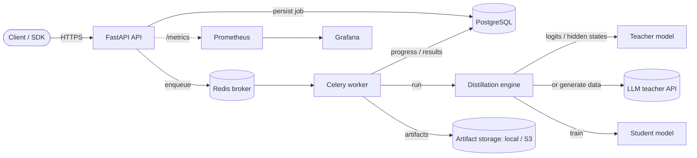

# Distillery

> A production-grade platform for **distilling large NLP teacher models into small, fast student models**.

[](https://github.com/uniiq-ai/distillery/actions/workflows/ci.yml)
[](#testing)
[](LICENSE)
[](pyproject.toml)

Distillery turns expensive teacher transformers into student models that are **a fraction of the
size, dramatically cheaper to serve, and faster** — while retaining most of the teacher's quality.
It exposes the whole workflow as a hardened REST API with asynchronous training workers, durable
job tracking, full observability, and one-command local and Kubernetes deployments.

---

## Table of contents

- [Why Distillery](#why-distillery)
- [Distillation strategies](#distillation-strategies)
- [Architecture at a glance](#architecture-at-a-glance)
- [Quickstart](#quickstart)
- [Using the API](#using-the-api)
- [Using the CLI](#using-the-cli)
- [Configuration](#configuration)
- [Project structure](#project-structure)
- [Testing](#testing)
- [Deployment](#deployment)
- [Documentation](#documentation)
- [Contributing & license](#contributing--license)

---

## Why Distillery

Knowledge distillation (Hinton et al., 2015) is the standard technique for model compression, but
turning it into a *reliable service* requires far more than a training script: job orchestration,
persistence, authentication, rate limiting, artifact storage, observability, reproducibility, and
safe deployment. Distillery provides all of that, built on **Clean Architecture** so the
distillation core stays decoupled from the web, database, and queue.

Highlights:

- **Three distillation strategies** behind one pluggable interface (see below).
- **REST API** (FastAPI) with API-key **and** JWT auth, RBAC, rate limiting, OpenAPI docs.
- **Asynchronous workers** (Celery + Redis) for long-running training, with live progress.
- **Durable job store** (PostgreSQL) and **artifact storage** (local FS or S3-compatible).
- **First-class observability**: structured JSON logs, Prometheus metrics, Grafana dashboard.
- **Reproducible & testable**: deterministic seeding, an offline tiny-model path, ≥95% test coverage.
- **Ship anywhere**: Docker, Docker Compose, and Kustomize-based Kubernetes manifests with CI/CD.

## Distillation strategies

| Strategy | What it matches | Teacher | When to use |
|---|---|---|---|
| `response_based` | Softened teacher **logits** (KL) + ground-truth cross-entropy | A HuggingFace classifier | The default; same model family, shared tokenizer. |
| `feature_based` | Logits **plus intermediate hidden states** (FitNets/TinyBERT) | A HuggingFace classifier | Deeper compression; student much smaller than teacher. |
| `llm_teacher` | A corpus **generated or labelled by an LLM** (e.g. Claude), then supervised fine-tuning | A hosted LLM | You lack labelled data, or want an LLM's knowledge in a tiny model. |

> **Constraint (documented):** the response-/feature-based strategies assume the teacher and
> student **share a tokenizer/vocabulary** — the standard setup (e.g. DistilBERT ← BERT). Each
> batch is tokenised once with the student tokenizer and fed to both models, which makes logit and
> hidden-state matching well-defined.

## Architecture at a glance



Distillery follows Clean Architecture — dependencies point inward toward the domain:

```
api / cli  ──►  application  ──►  domain  ◄──  core (engine), infrastructure (db, queue, storage, security)
```

The full picture, with low-level, sequence, data-flow, deployment and ER diagrams, lives in
[`docs/architecture/`](docs/architecture/overview.md).

## Quickstart

### Option A — Docker Compose (full stack)

```bash
git clone https://github.com/uniiq-ai/distillery.git
cd distillery
cp .env.example .env            # tweak secrets for anything non-local
make up                          # postgres + redis + api + worker + prometheus + grafana
```

- API & docs: <http://localhost:8000/docs>
- Health: <http://localhost:8000/health> · Metrics: <http://localhost:8000/metrics>
- Grafana: <http://localhost:3000> (anonymous) · Prometheus: <http://localhost:9090>

A bootstrap admin API key (`dev-local-admin-key` by default) is seeded at startup — use it in the
`X-API-Key` header.

### Option B — Local Python (library + CLI, no services)

```bash
make install            # creates .venv and installs ".[dev]"
make test               # run the full test suite
# Run a real distillation locally from a config file (no DB/queue needed):
.venv/bin/distillery distill examples/configs/response_based.json --output ./artifacts/demo
```

## Using the API

Create a distillation job (response-based KD), then poll it:

```bash
KEY=dev-local-admin-key

curl -s -X POST http://localhost:8000/api/v1/jobs \
  -H "X-API-Key: $KEY" -H 'Content-Type: application/json' \
  -d @examples/requests/create_job_response_based.json | jq .id
```

```bash
curl -s http://localhost:8000/api/v1/jobs/<JOB_ID> -H "X-API-Key: $KEY" | jq '.status, .evaluation'
curl -s http://localhost:8000/api/v1/jobs/<JOB_ID>/artifacts -H "X-API-Key: $KEY" | jq .
```

Authentication accepts **either** an API key (`X-API-Key`) or a **bearer JWT**
(`POST /api/v1/auth/login`). Roles are `viewer` < `operator` < `admin`. Full endpoint reference:
[`docs/api/reference.md`](docs/api/reference.md). Interactive docs are served at `/docs` (Swagger)
and `/redoc`.

## Using the CLI

```bash
distillery --help
distillery distill <config.json|yaml> --output <dir>   # run a distillation locally
distillery serve                                        # run the API
distillery worker                                       # run a Celery worker
distillery db upgrade                                   # apply migrations
distillery db seed                                      # seed bootstrap admin key
distillery user create alice@example.com --role operator
distillery apikey create alice@example.com --name laptop
```

## Configuration

All configuration comes from the environment (Twelve-Factor), validated by Pydantic. Variables are
prefixed `DISTILLERY_` and nested groups use `__`. See [`.env.example`](.env.example) for the full
list. Key settings:

| Variable | Default | Description |
|---|---|---|
| `DISTILLERY_ENV` | `development` | `development` \| `staging` \| `production`. |
| `DISTILLERY_DATABASE__URL` | local Postgres | SQLAlchemy URL (psycopg v3). |
| `DISTILLERY_QUEUE__BROKER_URL` | `redis://…/0` | Celery broker. |
| `DISTILLERY_QUEUE__EAGER` | `false` | Run jobs synchronously in-process (dev/tests). |
| `DISTILLERY_STORAGE__BACKEND` | `local` | `local` \| `s3`. |
| `DISTILLERY_SECURITY__JWT_SECRET` | `change-me` | **Must** be ≥32 random chars in production. |
| `DISTILLERY_SECURITY__BOOTSTRAP_API_KEYS` | _empty_ | Comma-separated admin keys, hashed at startup. |
| `DISTILLERY_LLM__ANTHROPIC_API_KEY` | _empty_ | Required for `llm_teacher` jobs. |

Production fails fast on insecure config (weak JWT secret, debug on).

## Project structure

```
src/distillery/
├── domain/          # Pure business model: entities, value objects, events, ports, exceptions
├── application/     # Use-case services (job, pipeline, auth) + DTOs
├── core/            # Distillation engine: losses, data, models, strategies, trainer, evaluation
├── teachers/llm/    # LLM-teacher data generation/labelling (Anthropic adapter)
├── infrastructure/  # Adapters: db, storage, queue, observability, security
├── api/             # FastAPI app, routers, schemas, deps, middleware, errors
├── cli/             # Typer CLI
├── config/          # Pydantic settings
└── bootstrap.py     # Composition root (wires adapters → services)

deploy/   docker/ · kubernetes/ (base + overlays) · monitoring/
docs/     architecture/ · api/ · guides/ · operations/ · decisions (ADRs)
tests/    unit/ · integration/ · e2e/ · load/
migrations/  Alembic
```

See [`docs/architecture/folder-structure.md`](docs/architecture/folder-structure.md) for a
file-by-file tour.

## Testing

```bash
make test            # full suite + coverage (fails under 95%)
make test-unit       # fast unit tests only
make lint typecheck  # ruff + black + mypy
make check           # everything CI runs
```

The suite spans unit, integration, end-to-end (API + CLI), and load (`tests/load/locustfile.py`).
Heavy ML tests use an **offline tiny-model path** (`config_only=True`) so they run in seconds on
CPU with no downloads. Coverage is enforced at **≥95%** of meaningful lines.

## Deployment

- **Docker**: a single multi-stage image runs the API or worker (selected by the entrypoint).
- **Compose**: `make up` for the full local stack.
- **Kubernetes**: `kubectl apply -k deploy/kubernetes/overlays/production` (Kustomize base +
  staging/production overlays, HPA, PDB, probes, migration Job, non-root hardened pods).
- **CI/CD**: GitHub Actions for lint/type/test, image build & publish to GHCR on tags, and a
  security suite (pip-audit, Bandit, CodeQL, Trivy, gitleaks).

See the [deployment guide](docs/guides/deployment-guide.md) and
[operational runbook](docs/operations/runbook.md).

## Documentation

| Doc | Contents |
|---|---|
| [Architecture](docs/architecture/overview.md) | High/low-level design, diagrams, rationale, scalability, reliability, DR. |
| [API reference](docs/api/reference.md) | Every endpoint, auth, errors, pagination, examples. |
| [Database](docs/database.md) | ER diagram, schema, indexes, migrations, backup. |
| [Security](docs/security.md) | AuthN/Z, secrets, OWASP, input validation, supply chain. |
| [User guide](docs/guides/user-guide.md) | End-to-end job workflows for each strategy. |
| [Developer guide](docs/guides/developer-guide.md) | Local setup, adding a strategy, conventions. |
| [Administrator guide](docs/guides/administrator-guide.md) | Operating the platform, users, quotas. |
| [Deployment guide](docs/guides/deployment-guide.md) | Compose & Kubernetes, scaling, rollback. |
| [Troubleshooting](docs/guides/troubleshooting.md) | Common failures and fixes. |
| [Runbook](docs/operations/runbook.md) | On-call procedures, alerts, incident response. |
| [ADRs](docs/decisions/) | Architecture decision records. |

## Contributing & license

Contributions are welcome — see [CONTRIBUTING.md](CONTRIBUTING.md) and the
[Code of Conduct](CODE_OF_CONDUCT.md). Security issues: [SECURITY.md](SECURITY.md). Release history:
[CHANGELOG.md](CHANGELOG.md).

Licensed under the **Apache License 2.0** — see [LICENSE](LICENSE).
