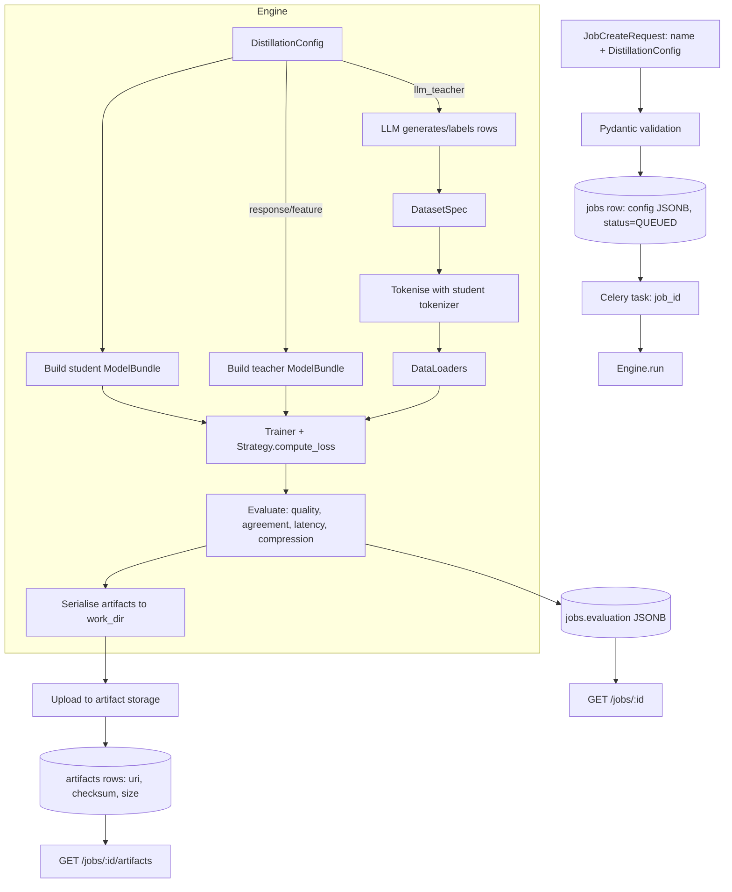

# Data flow

How data moves through a distillation, from request to downloadable artifacts.

## Data at rest

| Data | Location | Format | Notes |
|---|---|---|---|
| Job spec | `jobs.config` | JSONB | Exact `DistillationConfig`; reproducible. |
| Progress | `jobs.progress` | JSONB | Throttled snapshots. |
| Evaluation | `jobs.evaluation` | JSONB | Metrics, agreement, compression. |
| Resource usage | `jobs.resource_usage` | JSONB | Duration, peak memory, teacher tokens. |
| Student model | artifact store | HF `save_pretrained` dir | `student_model/`. |
| Evaluation report | artifact store | JSON | `evaluation_report.json`. |
| Config snapshot | artifact store | JSON | `config_snapshot.json` (re-run any job). |
| Training log | artifact store | JSON | Per-epoch loss history. |
| Synthetic dataset | artifact store | JSONL | Only for `llm_teacher` jobs. |
| Credentials | `users`, `api_keys` | hashed | PBKDF2 (passwords), SHA-256 (API keys). |

## Data in transit

- Client ⇄ API: HTTPS (TLS terminated at ingress); secure response headers; request-body size limit.
- API ⇄ DB: TLS to managed PostgreSQL (recommended); pooled connections.
- API/Worker ⇄ Redis: broker traffic on the cluster network (use TLS/ACLs in production).
- Worker ⇄ LLM API: HTTPS to the provider; API key from Secret, never logged.
- Worker ⇄ S3: HTTPS via boto3; IAM-scoped credentials.

## Reproducibility

Every job persists its exact config (DB + `config_snapshot.json`) and uses deterministic seeding
(`TrainingConfig.seed` seeds Python/NumPy/Torch; the offline tokenizer uses a stable CRC32 hash).
Re-submitting a saved config snapshot reproduces the run.
