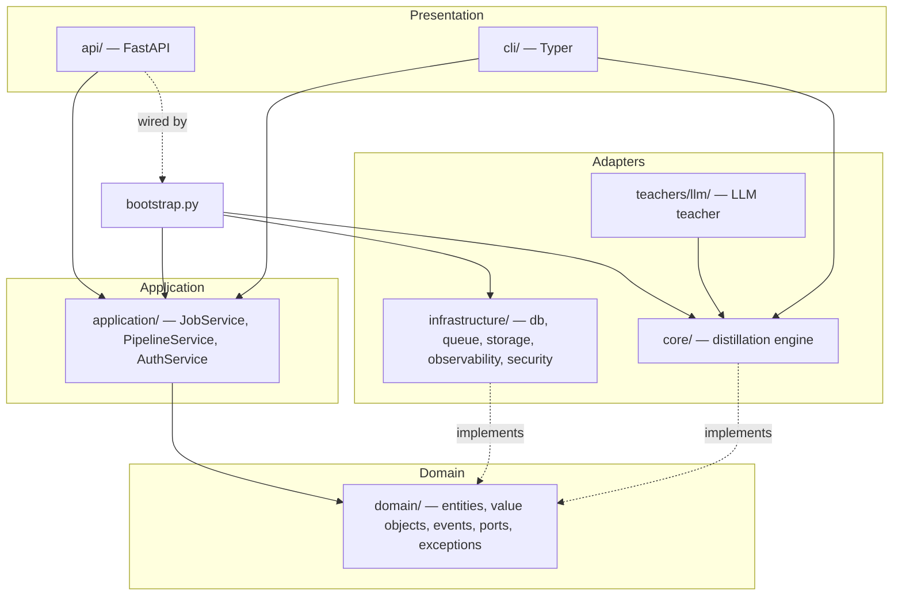
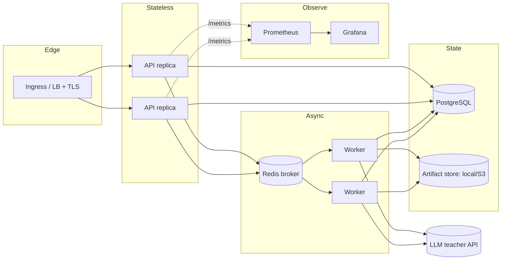
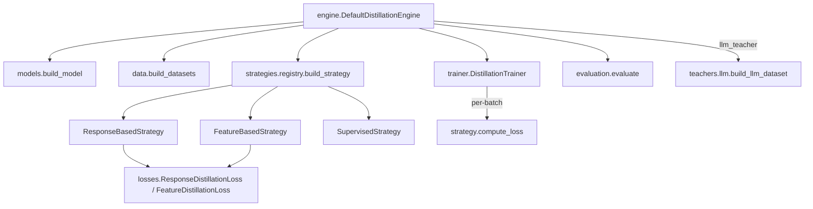

# Architecture overview

This document explains Distillery's design top-to-bottom for a reader who has never seen the
project. It covers the high- and low-level architecture, component interactions, the technology
choices and their trade-offs, and the non-functional strategies (scalability, performance,
security, reliability, fault tolerance, disaster recovery, cost, extensibility).

Companion documents:

- [Folder structure](folder-structure.md) — file-by-file tour.
- [Sequence diagrams](sequence-diagrams.md) — request/job lifecycles.
- [Data flow](data-flow.md) — how data moves through a distillation.
- [Deployment architecture](deployment.md) — Compose and Kubernetes topologies.
- [Database](../database.md), [API reference](../api/reference.md), [Security](../security.md).

---

## 1. Design goals

1. **Keep the ML core pure.** The distillation engine knows nothing about HTTP, databases or
   queues. It can be unit-tested and run from a CLI in isolation.
2. **Make every run reproducible and observable.** Deterministic seeding, persisted config
   snapshots, structured logs, metrics, and durable artifacts.
3. **Be safe by default.** Strong authentication, least-privilege RBAC, input validation, secure
   headers, rate limiting, and fail-fast production config checks.
4. **Scale the slow part independently.** Training is CPU/GPU-bound and long-running; it runs on
   horizontally-scalable workers, decoupled from the stateless API.
5. **Be extensible.** New distillation strategies, teachers, storage backends, or auth methods plug
   in behind interfaces without touching call sites.

## 2. Clean Architecture layering

Dependencies point **inward**. Inner layers never import outer ones.

| Layer | Package | Responsibility | May import |
|---|---|---|---|
| Domain | `distillery.domain` | Entities, value objects, domain events, **ports** (interfaces), exceptions. Pure Python + Pydantic. | nothing internal |
| Application | `distillery.application` | Use-case orchestration via ports only. | `domain` |
| Core (engine) | `distillery.core` | Losses, data, models, strategies, trainer, evaluation. Implements the `DistillationEngine` port. | `domain` |
| Teachers | `distillery.teachers` | LLM teacher data generation/labelling. | `domain`, `core`, `config` |
| Infrastructure | `distillery.infrastructure` | DB, queue, storage, observability, security adapters implementing ports. | `domain`, `config` |
| Presentation | `distillery.api`, `distillery.cli` | HTTP / CLI surfaces. | all of the above |
| Composition root | `distillery.bootstrap` | The **only** place adapters are wired into services. | everything |

**Why this matters:** the engine and domain have zero framework dependencies, so they are trivially
testable; swapping Postgres for another store, Celery for another queue, or local storage for S3 is
a one-file change in `bootstrap.py`. The dependency rule is enforced in review and is visible in the
import graph (e.g. `domain/*` imports only stdlib + Pydantic).

## 3. High-level components

- **API** (FastAPI, stateless): authentication, validation, job CRUD, enqueue, reads job state and
  artifacts. Horizontally scalable behind a load balancer; autoscaled on CPU/memory.
- **Worker** (Celery): consumes jobs, runs the engine, streams progress, uploads artifacts, writes
  terminal state. Scaled independently of the API (training is the expensive part).
- **PostgreSQL**: durable job/user/api-key/artifact store. Value objects are persisted as JSONB.
- **Redis**: Celery broker + result backend, and the distributed rate-limiter store.
- **Artifact storage**: local filesystem (single node) or S3-compatible (production).
- **LLM teacher API**: external provider (Anthropic) used only by `llm_teacher` jobs.
- **Prometheus/Grafana**: metrics scrape + dashboards; alert rules in `deploy/monitoring/alerts.yml`.

## 4. Low-level: the distillation engine

The engine (`distillery.core`) is composed of small, single-responsibility modules:

- **`losses.py`** — pure-PyTorch objectives:
  - `ResponseDistillationLoss`: `α·T²·KL(teacher‖student) + (1−α)·CE(student, y)`.
  - `FeatureDistillationLoss`: mask-aware MSE between projected student and teacher hidden states.
- **`models.py`** — builds a `ModelBundle` (model + tokenizer + shape metadata). The
  `config_only` path builds a tiny BERT + deterministic hashing tokenizer with **no network I/O**
  (used by CI/tests). Documents the **shared-tokenizer** constraint.
- **`data.py`** — loads inline/JSONL/CSV/HF-Hub datasets, resolves labels, tokenises, builds
  deterministic dataloaders.
- **`strategies/`** — the Strategy pattern: each strategy only implements `compute_loss`; a registry
  maps the `DistillationStrategy` enum to a factory (Open/Closed).
- **`trainer.py`** — strategy-agnostic loop: AdamW with decay groups, linear warmup schedule,
  gradient accumulation + clipping, deterministic seeding, throttled progress callbacks, optional
  early stopping with best-weight restore.
- **`evaluation.py`** — accuracy/precision/recall/F1, **teacher agreement** (fidelity), latency, and
  compression stats.
- **`engine.py`** — orchestrates the above and serialises artifacts to a working directory, returning
  `EngineResult` (evaluation + resource usage + artifact descriptors). It is **infrastructure-free**:
  the worker uploads the descriptors to durable storage.

## 5. Technology choices & trade-offs

| Area | Choice | Why | Trade-off / alternative |
|---|---|---|---|
| Language/ML | Python + PyTorch + HF Transformers | De-facto standard for NLP distillation; huge ecosystem. | Heavier images; mitigated with CPU wheels + multi-stage build. |
| API | FastAPI + Pydantic v2 | Async, typed, OpenAPI for free, validation reuse with domain VOs. | Tied to Python; fine here. |
| Persistence | PostgreSQL + SQLAlchemy 2.0 | ACID, JSONB for value objects, mature tooling, Alembic migrations. | Could use a document store; relational fits jobs/users/keys. |
| Queue | Celery + Redis | Battle-tested, late-ack redelivery, easy local + cloud. | Could use Arq/RQ/Dramatiq; Celery is the most proven for long jobs. |
| Config | pydantic-settings | Typed, env-driven, fail-fast (Twelve-Factor). | — |
| Auth | API keys (SHA-256) + JWT (PyJWT) | API keys for services, JWT for users; no heavy session store. | OAuth2/OIDC can layer on later. |
| Storage | Local FS / S3 (boto3) | Local for dev, S3 for prod durability + scale. | — |
| Observability | structlog + prometheus-client | Structured logs + pull metrics, standard in K8s. | OTLP tracing is a documented extension point. |
| Tests | pytest (+offline tiny models) | Fast, hermetic, CPU-only, ≥95% coverage. | — |

## 6. Non-functional strategies

### Scalability
- **API**: stateless → scale horizontally; `HorizontalPodAutoscaler` on CPU/memory (3→10 replicas).
- **Workers**: scale on queue depth (KEDA/queue-length metric recommended) independently of the API.
- **DB**: connection pooling (`pool_size`/`max_overflow`); read replicas for heavy read traffic;
  indexed queries on `(owner_id, status)` and `(status, created_at)`.
- **Data**: large datasets stream from HF Hub / object storage; `max_train_samples` bounds memory.

### Performance
- Throttled progress writes (≤ every 5% or 3 s) keep DB write amplification low during training.
- Linear-warmup scheduler + AdamW decay groups for stable convergence.
- Latency is **measured** per job (student vs teacher) and reported in the evaluation.
- CPU-only inference path for tests; GPU via a CUDA base image and `device=cuda`.
- HTTP latency histograms exported for p50/p95/p99 SLO tracking.

### Security
See [security.md](../security.md). Summary: hashed credentials, RBAC, OWASP secure headers, strict
input validation (Pydantic), SSRF-aware (no arbitrary remote code by default), rate limiting,
non-root hardened containers, dependency + image + secret scanning in CI.

### Reliability & fault tolerance
- **Job state machine** with only legal transitions; terminal states are immutable.
- Celery `task_acks_late` + `reject_on_worker_lost` → a job is redelivered if a worker dies
  mid-training (the pipeline is idempotent: it no-ops unless the job is still `QUEUED`).
- Short DB transactions per lifecycle step → progress is visible and failures are localized.
- API readiness probe (`/ready`) verifies DB connectivity; liveness (`/health`) is dependency-free.
- PodDisruptionBudgets keep minimum replicas during voluntary disruptions; rolling updates with
  `maxUnavailable: 0` for the API.

### Disaster recovery
- **RPO/RTO**: driven by managed PostgreSQL PITR (point-in-time recovery) and S3 versioning of
  artifacts. Target RPO ≤ 5 min (WAL archiving), RTO ≤ 30 min (restore + redeploy).
- All state is in PostgreSQL + object storage; the API/worker are stateless and recreated from the
  container image. Migrations are versioned (Alembic) and run as a pre-deploy Job.
- Configuration is reproducible from `.env`/Secrets; bootstrap keys re-seed idempotently.

### Cost optimization
- API and workers scale to demand; workers can scale to zero between jobs (queue-driven).
- CPU base image keeps cost low for small/medium distillations; GPU only when configured.
- Artifacts in S3 with lifecycle rules (e.g. transition old student models to infrequent-access).
- `max_train_samples`/`max_steps`/early stopping cap compute per job.

### Future extensibility
- **New strategy**: implement `DistillationStrategy.compute_loss`, register it — no call-site
  changes. (See the [developer guide](../guides/developer-guide.md).)
- **New teacher/provider**: implement the `LLMClient` protocol.
- **New storage/queue/auth**: implement the corresponding port and wire it in `bootstrap.py`.
- **Tracing**: add an OTLP exporter in `infrastructure/observability` (settings already present).
- **New modality** (vision): the same ports/trainer apply; provide a modality-specific `models`/`data`.
