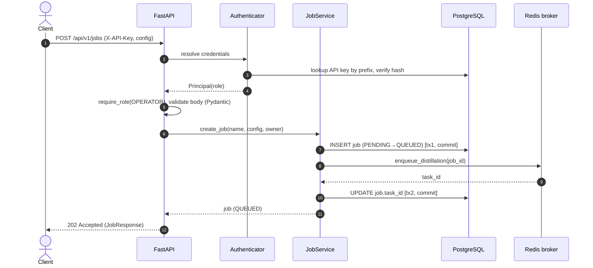
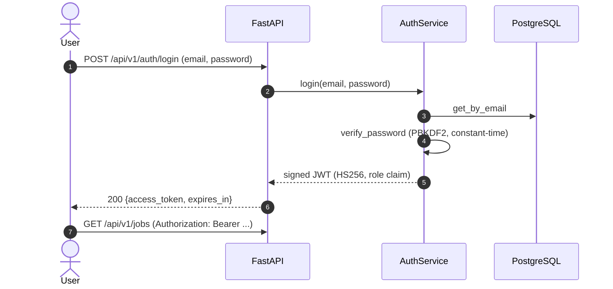

# Sequence diagrams

## 1. Create a distillation job (async, production)



## 2. Worker executes the job

```mermaid
sequenceDiagram
    autonumber
    participant Q as Redis broker
    participant W as Celery worker
    participant PS as PipelineService
    participant DB as PostgreSQL
    participant E as Engine
    participant S as Artifact storage
    Q->>W: deliver run_distillation_job(job_id)
    W->>PS: run_job(job_id)
    PS->>DB: load job; if QUEUED → RUNNING [commit]
    loop training (throttled)
        E-->>PS: on_progress(JobProgress)
        PS->>DB: UPDATE progress (≤ every 5% / 3s)
    end
    PS->>E: run(config, work_dir)
    E->>E: build models, data, strategy, train, evaluate
    E-->>PS: EngineResult (eval, usage, artifacts)
    PS->>S: upload artifacts (model, report, config, logs)
    PS->>DB: RUNNING → SUCCEEDED (+eval, +artifacts) [commit]
    Note over PS,DB: On any exception → RUNNING → FAILED (+error)
```

## 3. Failure & redelivery (fault tolerance)

```mermaid
sequenceDiagram
    autonumber
    participant Q as Redis broker
    participant W1 as Worker A (dies)
    participant W2 as Worker B
    participant PS as PipelineService
    participant DB as PostgreSQL
    Q->>W1: deliver job (acks_late)
    W1->>PS: run_job → RUNNING
    W1--xQ: crash before ack
    Q->>W2: redeliver job (reject_on_worker_lost)
    W2->>PS: run_job(job_id)
    PS->>DB: load job; status == RUNNING (not QUEUED)
    PS-->>W2: no-op (idempotent guard); operator may re-queue
```

## 4. User login (JWT)


