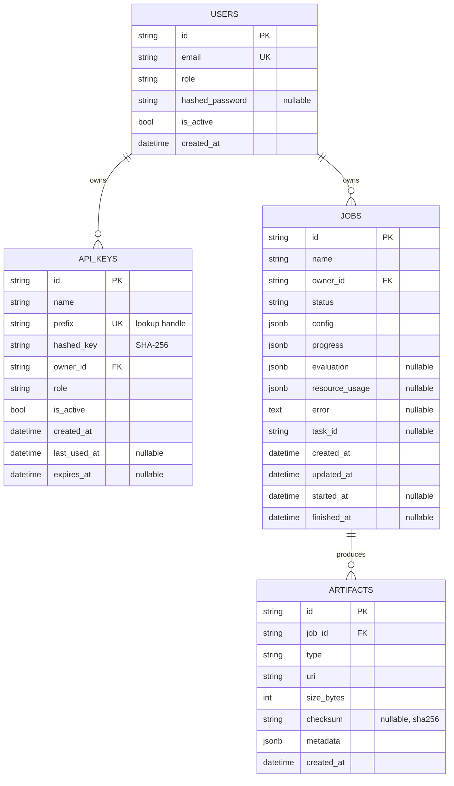

# Database design

Distillery uses **PostgreSQL** via SQLAlchemy 2.0 (psycopg v3). Value objects are stored as
**JSONB** so the relational schema stays small while preserving the full, reproducible job spec and
results.

## Entity-relationship diagram



## Tables

### `users`
| Column | Type | Notes |
|---|---|---|
| `id` | varchar(36) PK | UUID. |
| `email` | varchar(320) **unique** (`uq_users_email`) | Login identity. |
| `role` | varchar(32) | `viewer`/`operator`/`admin`. |
| `hashed_password` | varchar(512), null | PBKDF2 encoded; null for API-key-only users. |
| `is_active` | bool | Soft disable. |
| `created_at` | timestamptz | Server default `now()`. |

### `api_keys`
| Column | Type | Notes |
|---|---|---|
| `id` | varchar(36) PK | |
| `prefix` | varchar(16) **unique** (`uq_api_keys_prefix`) | Indexed lookup handle (first chars of the key). |
| `hashed_key` | varchar(512) | SHA-256 of the full key (high-entropy ⇒ fast hash is safe). |
| `owner_id` | varchar(36) FK → `users.id` (`ON DELETE CASCADE`) | |
| `role` | varchar(32) | Key's effective role (≤ owner's). |
| `last_used_at`, `expires_at` | timestamptz, null | Auditing + expiry. |

### `jobs`
| Column | Type | Notes |
|---|---|---|
| `id` | varchar(36) PK | |
| `owner_id` | varchar(36) FK → `users.id` (CASCADE) | |
| `status` | varchar(32) | `pending`/`queued`/`running`/`succeeded`/`failed`/`cancelled`. |
| `config` | jsonb | Full `DistillationConfig` — reproducible. |
| `progress`/`evaluation`/`resource_usage` | jsonb | Value objects. |
| `error` | text, null | Failure message. |
| `task_id` | varchar(64), null | Celery task id. |
| timestamps | timestamptz | `created/updated/started/finished`. |

**Indexes:** `ix_jobs_owner_status (owner_id, status)`, `ix_jobs_status_created (status, created_at)`.

### `artifacts`
| Column | Type | Notes |
|---|---|---|
| `id` | varchar(36) PK | |
| `job_id` | varchar(36) FK → `jobs.id` (CASCADE), indexed (`ix_artifacts_job_id`) | |
| `type` | varchar(32) | `student_model`/`evaluation_report`/`synthetic_dataset`/`training_log`/`config_snapshot`. |
| `uri` | varchar(2048) | Storage URI (`file://…` or `s3://…`). |
| `size_bytes` | int | |
| `checksum` | varchar(128), null | SHA-256 for single-file artifacts. |
| `metadata` | jsonb | e.g. `{"format": "huggingface"}`. |

## Normalization

The relational schema is in **3NF** for identity/ownership/lifecycle (users, api_keys, jobs,
artifacts). Variable, evolving, read-mostly structures (config, metrics, progress) are stored as
JSONB rather than over-normalised into many sparse tables — a deliberate trade-off that keeps writes
atomic and the schema stable as the engine evolves, while JSONB still supports indexing/queries if
needed later.

## Constraints & integrity

- Foreign keys with `ON DELETE CASCADE`: deleting a user removes their keys and jobs; deleting a job
  removes its artifacts.
- Unique constraints on `users.email` and `api_keys.prefix`.
- Constraint names follow a fixed naming convention (`pk_`, `uq_`, `fk_`, `ix_`) so Alembic
  autogenerate is stable and migrations are reviewable.
- Application-level invariants (legal status transitions, role hierarchy, config validity) are
  enforced in the domain layer before persistence.

## Migrations

Schema changes are versioned with **Alembic** (`migrations/`). The DB URL is injected from settings
(`migrations/env.py`), so migrations honour the same configuration as the app.

```bash
distillery db upgrade            # or: alembic upgrade head
alembic revision --autogenerate -m "describe change"   # create a migration
alembic downgrade -1             # roll back one revision
```

In Kubernetes, migrations run as a **pre-deploy Job** (`migration-job.yaml`, Argo PreSync hook).
Never rely on `create_all` in production (it exists only as a dev convenience: `db create-all`).

## Seed data

`distillery db seed` (and API startup in development) idempotently provisions a **system admin
user** and registers the bootstrap API keys from `DISTILLERY_SECURITY__BOOTSTRAP_API_KEYS` (hashed
at rest). Re-running is a no-op if the keys already exist.

## Query optimization

- Job listing filters on indexed `(owner_id, status)`; ordering by `created_at` is covered by
  `(status, created_at)`.
- Artifacts are eager-loaded with `selectinload` to avoid N+1 queries.
- Pagination uses `LIMIT/OFFSET` (cap 100); for very large histories switch to keyset pagination on
  `(created_at, id)`.

## Scaling & backup

- **Connection pooling**: `pool_size`/`max_overflow`/`pool_recycle` from settings; `pool_pre_ping`
  to survive DB failovers.
- **Read replicas**: route list/get reads to a replica for high read volume.
- **Backups/DR**: managed PostgreSQL automated backups + WAL archiving (PITR). Target RPO ≤ 5 min,
  RTO ≤ 30 min. Test restores regularly (see the [runbook](operations/runbook.md)).
- **Retention**: archive or delete terminal jobs and their artifacts per policy; artifact storage
  has its own lifecycle rules.
