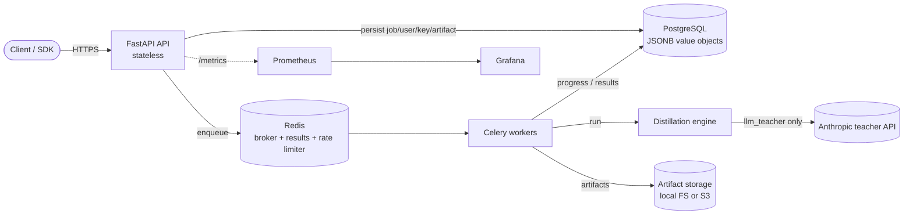

# Administrator guide

This guide is for the people who **operate a running Distillery deployment**: managing users, API
keys and roles; reading the configuration; choosing storage; scaling the API and workers;
monitoring; backups and retention; logs; rate limits; and performing upgrades.

If you are looking to *install* or *deploy* Distillery for the first time, start with the
[deployment guide](./deployment-guide.md). For incident response and on-call procedures, see the
[operational runbook](../operations/runbook.md). For the security model (authN/Z, secrets, OWASP),
see [security](../security.md). For the deployment topology, see
[deployment architecture](../architecture/deployment.md). When something is broken, the
[troubleshooting guide](./troubleshooting.md) lists common failures and fixes.

---

## 1. What you are operating

Distillery is composed of a small number of independently scalable pieces. Knowing which piece does
what is the foundation of operating it well.



| Component | Role | Stateful? |
|---|---|---|
| **FastAPI API** | HTTP surface: auth, job submission, status, artifact links, metrics. | No — fully stateless. |
| **Celery workers** | Execute long-running distillation jobs and report progress. | No — work is durable in DB + object store. |
| **PostgreSQL** | System of record: jobs, users, API keys, artifact metadata. Domain value objects are stored as **JSONB**. | Yes. |
| **Redis** | Celery **broker** and **result backend**, *and* the **distributed rate limiter**. | Yes (operational state). |
| **Artifact storage** | Trained student models and reports. Backend is **local FS** or an **S3-compatible** bucket. | Yes. |
| **Prometheus + Grafana** | Metrics scraping, dashboards, alerting. | Yes (metrics TSDB). |
| **Anthropic teacher API** | External LLM teacher — used **only** by `llm_teacher` jobs. | External. |

The key operational property: **all durable state lives in PostgreSQL and the object store**. The
API and workers are stateless and disposable, which is what makes scaling, rolling upgrades and
disaster recovery straightforward.

---

## 2. Managing users, keys and roles

### 2.1 The role model

Distillery uses three ranked roles:

```
viewer  <  operator  <  admin
```

| Role | Can do |
|---|---|
| `viewer` | Read-only access to its own jobs and artifacts. |
| `operator` | Create and manage its own distillation jobs. |
| `admin` | Everything, plus user administration. |

Two important rules enforced by the platform (see [security](../security.md)):

- **Endpoints enforce a minimum role.** A caller below the required rank is rejected.
- **A principal cannot mint an API key more privileged than itself.** If an `operator` requests an
  `admin` key, the key is downgraded to `operator`.

### 2.2 Authentication mechanisms

There are two ways to authenticate, both resolving to the same role-based principal:

- **API key** — sent in the `X-API-Key` header (configurable via
  `DISTILLERY_SECURITY__API_KEY_HEADER`). The plaintext secret is shown **exactly once** at
  creation; only a prefix and a hash are stored.
- **JWT bearer token** — obtained from `POST /api/v1/auth/login` with email + password, then sent
  as `Authorization: Bearer <token>`. Tokens expire after
  `DISTILLERY_SECURITY__ACCESS_TOKEN_TTL_SECONDS`.

### 2.3 Provisioning via the CLI

The CLI runs inside any image/pod that has database access (for example
`kubectl exec` into an API pod, or `docker compose exec api`).

```bash
# Create a user (you will be prompted for the password if --password is omitted)
distillery user create alice@example.com --password 's3cret!' --role operator

# Issue an API key for an existing user — the secret is printed ONCE, store it now
distillery apikey create alice@example.com --name 'ci-runner' --role operator
```

`distillery user create` accepts `--role viewer|operator|admin` (default `viewer`).
`distillery apikey create` accepts `--name` (default `cli`) and `--role` (default `operator`), and
prints both the key **prefix** and the one-time **secret**.

### 2.4 Provisioning via the API

| Operation | Endpoint | Required role |
|---|---|---|
| Create a user | `POST /api/v1/auth/users` | `admin` |
| Issue an API key (for the caller) | `POST /api/v1/auth/api-keys` | any authenticated user |
| List your API keys | `GET /api/v1/auth/api-keys` | any authenticated user |
| Exchange credentials for a JWT | `POST /api/v1/auth/login` | none (public) |
| Describe the current principal | `GET /api/v1/auth/me` | any authenticated user |

```bash
# Admin creates a user
curl -s -X POST https://distillery.example.com/api/v1/auth/users \
  -H "X-API-Key: $ADMIN_KEY" -H 'Content-Type: application/json' \
  -d '{"email":"bob@example.com","password":"...","role":"operator"}'
```

### 2.5 Bootstrap admin keys

Cold-start (when no users or keys exist yet) is solved by **bootstrap API keys**:

- They are supplied as plaintext through `DISTILLERY_SECURITY__BOOTSTRAP_API_KEYS`
  (comma-separated) and are **hashed at startup** — never stored in clear.
- They are seeded **idempotently** both at application startup and by `distillery db seed`. Running
  seed repeatedly is safe.
- In Docker Compose the default bootstrap key is `dev-local-admin-key`.
- In production, set this from your secret manager (the example Kubernetes secret leaves it empty),
  and use it only to mint per-user admin keys, then remove it.

```bash
# Seed the system user and bootstrap keys from current configuration
distillery db seed
```

### 2.6 Secret rotation

| What | How |
|---|---|
| **A leaked API key** | Issue a replacement key for the same user, switch clients over, then let the old key expire (keys can carry an expiry) or remove it. Keys stamp `last_used_at`, which helps confirm a key is idle before retiring it. |
| **Bootstrap key** | Rotate the value in `DISTILLERY_SECURITY__BOOTSTRAP_API_KEYS` in your secret manager, redeploy, and re-seed. Mint real per-user admin keys so you are not dependent on the bootstrap key. |
| **JWT secret** (`DISTILLERY_SECURITY__JWT_SECRET`) | Rotating invalidates all outstanding JWTs (clients must log in again). Update the secret, restart the API. Must remain ≥32 random characters or the app refuses to start in production. |
| **Anthropic key** (`DISTILLERY_LLM__ANTHROPIC_API_KEY`) | Update in the secret manager and roll the workers. Only `llm_teacher` jobs are affected. |
| **Database / object-store credentials** | Rotate in the secret manager, then roll the API and workers. |

> All secrets come from the environment / secret manager — never code or VCS. See
> [security](../security.md) for the storage and hashing details.

---

## 3. Configuration reference

All configuration is **environment-driven** (Twelve-Factor), prefixed `DISTILLERY_`, with nested
groups delimited by `__`, and validated by **Pydantic** at startup. The complete, commented list is
in [`.env.example`](../../.env.example). The tables below group the keys you will most often touch.

> **Production fail-fast.** When `DISTILLERY_ENV=production`, the application **refuses to start** if
> the JWT secret is the default or shorter than 32 characters, or if `DISTILLERY_DEBUG=true`. This is
> intentional — a failed start beats a silently insecure one.

### Core

| Variable | Values / default | Purpose |
|---|---|---|
| `DISTILLERY_ENV` | `development` \| `staging` \| `production` | Selects environment behaviour and fail-fast checks. |
| `DISTILLERY_DEBUG` | `true` / `false` | Debug mode. **Must be `false` in production.** |
| `DISTILLERY_LOG_LEVEL` | `DEBUG` \| `INFO` \| `WARNING` \| `ERROR` | Log verbosity. |
| `DISTILLERY_LOG_FORMAT` | `json` \| `console` | `json` for production log shipping; `console` for local readability. |

### API (`DISTILLERY_API__`)

| Variable | Default | Purpose |
|---|---|---|
| `HOST` | `0.0.0.0` | Bind address. |
| `PORT` | `8000` | HTTP port. |
| `CORS_ORIGINS` | `["http://localhost:3000"]` | Allow-list of browser origins. |
| `DOCS_ENABLED` | `true` (dev/staging) | Serve `/docs` and `/redoc`. Disabled in the production config. |
| `MAX_REQUEST_BODY_BYTES` | (capped) | Maximum request body size; oversize requests get `413`. |

### Security (`DISTILLERY_SECURITY__`)

| Variable | Default | Purpose |
|---|---|---|
| `JWT_SECRET` | — | Signing secret. **≥32 chars in production or startup fails.** |
| `JWT_ALGORITHM` | `HS256` | JWT signing algorithm. |
| `ACCESS_TOKEN_TTL_SECONDS` | `3600` | JWT lifetime. |
| `API_KEY_HEADER` | `X-API-Key` | Header carrying the API key. |
| `BOOTSTRAP_API_KEYS` | empty in prod | Comma-separated admin keys, hashed at startup, seeded idempotently. |
| `RATE_LIMIT_PER_MINUTE` | `120` | Per-key/IP request budget (see §8). |

### Database (`DISTILLERY_DATABASE__`)

| Variable | Default | Purpose |
|---|---|---|
| `URL` | local Postgres | SQLAlchemy URL (psycopg v3). |
| `POOL_SIZE` | `10` | Base connection pool size **per process**. |
| `MAX_OVERFLOW` | `20` | Extra connections allowed beyond the pool. |
| `POOL_TIMEOUT_SECONDS` | `30` | Wait time for a free connection before erroring. |
| `POOL_RECYCLE_SECONDS` | — | Recycle connections older than this (avoids stale server-side connections). |
| `ECHO` | `false` | Log all SQL (debugging only). |

> **Pool sizing.** Total backend connections ≈ `(POOL_SIZE + MAX_OVERFLOW) × processes`, where
> processes = API replicas × `WEB_CONCURRENCY` plus worker replicas × `WORKER_CONCURRENCY`. Keep the
> sum comfortably under your PostgreSQL `max_connections`; use a pooler (e.g. PgBouncer) if you scale
> wide.

### Queue (`DISTILLERY_QUEUE__`)

| Variable | Default | Purpose |
|---|---|---|
| `BROKER_URL` | `redis://…/0` | Celery broker (Redis). |
| `RESULT_BACKEND` | `redis://…/1` | Celery result backend (Redis). |
| `WORKER_CONCURRENCY` | `2` | Concurrent tasks per worker process. |
| `TASK_TIME_LIMIT_SECONDS` | `86400` | Hard ceiling on a single job. |
| `EAGER` | `false` | Run jobs synchronously in-process — dev/tests only, never production. |

### Storage (`DISTILLERY_STORAGE__`)

| Variable | Default | Purpose |
|---|---|---|
| `BACKEND` | `local` \| `s3` | Artifact storage backend. |
| `LOCAL_ROOT` | `./artifacts` | Root directory when `BACKEND=local`. |
| `S3_BUCKET` | — | Bucket name when `BACKEND=s3`. |
| `S3_ENDPOINT_URL` | — | Custom endpoint for S3-compatible stores (MinIO/R2/etc.). |
| `S3_REGION` | `us-east-1` | Bucket region. |
| `S3_PREFIX` | — | Key prefix within the bucket. |

> AWS credentials are read from the standard `AWS_ACCESS_KEY_ID` / `AWS_SECRET_ACCESS_KEY`
> environment variables, not from `DISTILLERY_` keys.

### LLM teacher (`DISTILLERY_LLM__`)

| Variable | Default | Purpose |
|---|---|---|
| `ANTHROPIC_API_KEY` | — | Required for `llm_teacher` jobs. |
| `DEFAULT_TEACHER_MODEL` | `claude-sonnet-4-6` | Default teacher model. |
| `MAX_CONCURRENCY` | `4` | Concurrent calls to the teacher API. |
| `MAX_RETRIES` | `5` | Retries on transient teacher-API errors. |

### Training (`DISTILLERY_TRAINING__`)

| Variable | Default | Purpose |
|---|---|---|
| `DEVICE` | `auto` | `auto` \| `cpu` \| `cuda` \| `mps`. |
| `DEFAULT_SEED` | `42` | Default seed for reproducibility. |
| `MAX_EPOCHS` | `3` | Default training epoch ceiling. |

### Observability (`DISTILLERY_OBSERVABILITY__`)

| Variable | Default | Purpose |
|---|---|---|
| `METRICS_ENABLED` | `true` | Expose Prometheus metrics. |
| `METRICS_PORT` | `9100` | Worker metrics port (the API exposes `/metrics` on `8000`). |

---

## 4. Scaling

Because the API and workers are stateless, scaling is mostly about adding replicas and bounding
per-job work.

### 4.1 API

The API scales horizontally on CPU/memory. In Kubernetes a `HorizontalPodAutoscaler` does this
automatically:

- **HPA**: `3 → 10` replicas, targeting **70% CPU** and **80% memory**.
- **PodDisruptionBudget**: `minAvailable: 2` keeps capacity during voluntary disruptions.
- **Rolling update** with `maxUnavailable: 0` means no capacity is lost during a deploy.

Within each pod, `WEB_CONCURRENCY` sets the number of Uvicorn workers (the production config uses
`4`). Remember that each additional process consumes its own DB connection pool (see §3).

### 4.2 Workers

Workers scale **independently** of the API and should scale on **queue depth**, not CPU:

- Recommended: **KEDA** or the **Prometheus adapter** driving an HPA off Redis queue length.
- Workers can **scale to zero** when idle — there is no minimum-traffic requirement.
- `terminationGracePeriodSeconds: 120` gives in-flight jobs time to finish or checkpoint before a
  pod is evicted.
- Worker `PDB` is `minAvailable: 1`.

### 4.3 Bounding per-job compute

Long jobs are the main source of resource pressure. Cap them with training knobs:

- `training.max_train_samples` — cap the dataset size per job.
- `training.max_steps` — cap total optimizer steps.
- `training.early_stopping_patience` — stop when the validation metric stops improving.

Globally, `DISTILLERY_QUEUE__TASK_TIME_LIMIT_SECONDS` is the hard wall-clock ceiling per task.

### 4.4 Data tier

- **PostgreSQL**: tune connection pooling (§3); add **read replicas** for read-heavy reporting.
- **Redis**: used for broker, results and rate limiting — size it for the combined load.

---

## 5. Storage: local vs S3

Choose the artifact backend with `DISTILLERY_STORAGE__BACKEND`.

| | `local` | `s3` |
|---|---|---|
| Where artifacts live | A filesystem path (`LOCAL_ROOT`) | An S3-compatible bucket (`S3_BUCKET`/`S3_PREFIX`) |
| Multi-replica safe | Only with a shared volume | Yes (object store is shared by design) |
| Durability / DR | Whatever the volume provides | Bucket versioning + lifecycle rules |
| Recommended for | Local dev, single-node | **Staging and production** |

In Kubernetes the API/worker pods mount the artifacts path as an `emptyDir`, so for any multi-pod
deployment you **must** use `s3` (or another shared object store) — otherwise a job's artifacts are
only visible on the pod that produced them. The production ConfigMap ships with `BACKEND=s3`.

For an S3-compatible store that is not AWS (MinIO, Cloudflare R2, etc.), set `S3_ENDPOINT_URL` and
provide credentials via `AWS_ACCESS_KEY_ID` / `AWS_SECRET_ACCESS_KEY`.

---

## 6. Monitoring

### 6.1 Metrics

Structured JSON logs (structlog, each line tagged with a `request_id`) and Prometheus metrics are
emitted out of the box. The API serves metrics at **`/metrics`** on port `8000`; workers expose
metrics on `DISTILLERY_OBSERVABILITY__METRICS_PORT` (`9100`).

| Metric | Type | Labels | What it tells you |
|---|---|---|---|
| `distillery_http_requests_total` | counter | `method`, `path`, `status` | Request volume and error mix. |
| `distillery_http_request_duration_seconds` | histogram | — | API latency (compute p50/p95/p99). |
| `distillery_jobs_created_total` | counter | `strategy` | Submission rate per distillation strategy. |
| `distillery_jobs_finished_total` | counter | `status` | Completed vs failed jobs. |
| `distillery_jobs_in_progress` | gauge | — | Current concurrent jobs (≈ worker saturation). |
| `distillery_job_duration_seconds` | histogram | — | End-to-end job runtime distribution. |
| `distillery_llm_teacher_tokens_total` | counter | — | Token consumption against the Anthropic teacher API (cost driver). |

### 6.2 Dashboards

- Prometheus scrape config: [`deploy/monitoring/prometheus.yml`](../../deploy/monitoring/prometheus.yml).
- Grafana dashboard, auto-provisioned: [`deploy/monitoring/grafana/provisioning/`](../../deploy/monitoring/grafana/provisioning/).

In the local stack, Grafana is at `http://localhost:3000` and Prometheus at `http://localhost:9090`.
In Kubernetes, API pods carry `prometheus.io/scrape` annotations so a cluster Prometheus can
discover them.

### 6.3 Alerts and what they mean

Alert rules live in [`deploy/monitoring/alerts.yml`](../../deploy/monitoring/alerts.yml):

| Alert | Fires when | Severity | Likely cause / first action |
|---|---|---|---|
| `DistilleryApiDown` | No successful scrape of the API for 2m | critical | API pods down or unreachable — check pod status and probes. |
| `DistilleryHighErrorRate` | >5% of responses are `5xx` over 5m | warning | App or dependency failure — check logs by `request_id`, DB/Redis health. |
| `DistilleryHighLatencyP95` | p95 latency > 1.5s for 10m | warning | Saturation or slow DB — check HPA, pool timeouts, DB load. |
| `DistilleryJobFailureSpike` | >5 jobs failed in 15m | warning | Bad config, teacher-API errors, or worker resource limits — inspect failed jobs. |

For full triage steps see the [runbook](../operations/runbook.md).

---

## 7. Backups, retention and DR

All durable state is in **PostgreSQL** and the **object store**; the API and workers hold none.
That shapes the backup strategy:

| Asset | Strategy | Target |
|---|---|---|
| PostgreSQL | Managed automated backups + **point-in-time recovery (PITR)** | RPO ≤ 5 min, RTO ≤ 30 min |
| Artifacts (object store) | **S3 versioning** + lifecycle rules (transition/expire old versions) | Durable, recoverable |
| Redis | Operational state (queue/results/rate-limit). Treat as ephemeral; in-flight tasks re-run on loss. | — |

Because the application tier is stateless, disaster recovery is: restore PostgreSQL (to a PITR
target), point the deployment at the restored DB and the (versioned) bucket, and roll out the image.
No application-tier data needs restoring.

Logs are an audit trail (domain events keyed by `request_id`/`job_id`) — ship them to a central,
append-only store for retention (see §9 and [security](../security.md)).

---

## 8. Rate limits and quotas

- A **distributed rate limiter** backed by Redis enforces `DISTILLERY_SECURITY__RATE_LIMIT_PER_MINUTE`
  (default **120**) per API key / IP, using a fixed window.
- Because it is Redis-backed, the limit is shared across **all** API replicas — scaling out the API
  does not multiply the budget.
- Tune the value per environment; raise it for trusted internal callers, lower it to blunt abuse.
- Per-job compute quotas are governed by the training knobs and task time limit in §4.3.

---

## 9. Log management

- Logs are **structured JSON** (set `DISTILLERY_LOG_FORMAT=json`) with a `request_id` on every line,
  so a single request can be traced across API and worker.
- Set verbosity with `DISTILLERY_LOG_LEVEL` (`INFO` is the production default).
- Domain events (`JobStarted/Progressed/Completed/Failed`) are emitted to the same stream, forming
  an audit trail keyed by `request_id`/`job_id`.
- Ship container stdout to a central, append-only store (e.g. Loki, CloudWatch) for retention and
  SIEM integration. Containers run read-only and non-root, so do not write log files inside the pod.

---

## 10. Upgrade procedure

Distillery uses **Alembic** migrations and a strict **migrate-then-roll** discipline. Never use
`create_all` in production (the `distillery db create-all` command is a dev-only convenience).

### 10.1 The golden rule

1. **Migrate the database first** (as a gated step that must succeed).
2. **Then roll the application** (API and workers) to the new image.

Migrations are designed to be forward-compatible within a release, so the old and new code can
briefly coexist during a rolling update.

### 10.2 Running migrations

| Context | Command |
|---|---|
| CLI / Compose | `distillery db upgrade` (equivalently `alembic upgrade head`) |
| Author a new migration | `alembic revision --autogenerate -m "describe change"` |
| Kubernetes | A **pre-deploy Job** ([`deploy/kubernetes/base/migration-job.yaml`](../../deploy/kubernetes/base/migration-job.yaml)) that runs `migrate` and carries **Argo CD `PreSync` hook** annotations so it gates the rollout. |

### 10.3 Rolling the application

```bash
# Kubernetes: apply the overlay (pins the image tag, replica counts, resources)
kubectl apply -k deploy/kubernetes/overlays/production
```

The API rolls with `maxUnavailable: 0` (no lost capacity); workers drain gracefully thanks to the
120s termination grace period.

### 10.4 Rollback

If a release misbehaves:

```bash
kubectl rollout undo deploy/distillery-api
kubectl rollout undo deploy/distillery-worker
```

Because migrations are forward-compatible within a release, rolling the application back to the
previous image is safe without reversing the migration. For the full rollout/rollback flow and CI/CD
release path, see the [deployment guide](./deployment-guide.md).

---

## See also

- [Deployment guide](./deployment-guide.md) — Compose and Kubernetes deployment, CI/CD, checklist.
- [Operational runbook](../operations/runbook.md) — on-call procedures, alert triage, incidents.
- [Security](../security.md) — authentication, authorization, secrets, OWASP mapping.
- [Deployment architecture](../architecture/deployment.md) — topology and manifests.
- [Troubleshooting](./troubleshooting.md) — common failures and fixes.
