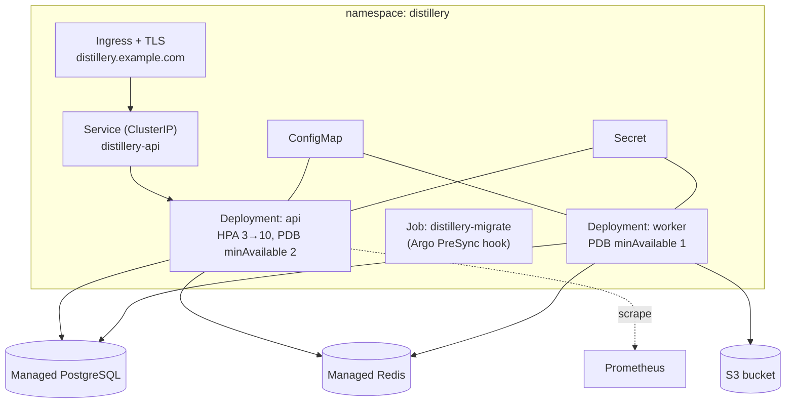
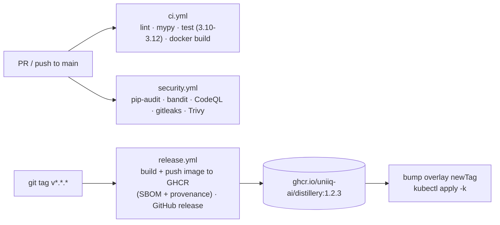

# Deployment guide

This guide walks through deploying Distillery, from a one-command local stack to a hardened
Kubernetes rollout, including the CI/CD release flow, health checks, rollback, and a go-live
checklist.

For day-2 operations (users, scaling, monitoring, backups, upgrades) see the
[administrator guide](./administrator-guide.md). For the topology and a tour of the manifests, see
[deployment architecture](../architecture/deployment.md). For the security model and hardening
posture, see [security](../security.md). For on-call procedures and incident response, see the
[operational runbook](../operations/runbook.md). When a deploy goes sideways, the
[troubleshooting guide](./troubleshooting.md) lists common failures and fixes.

---

## 1. Deployment paths at a glance

| Path | Use it for | Section |
|---|---|---|
| **Docker Compose** | Local development, demos, single-node evaluation. | [§3](#3-docker-compose) |
| **Kubernetes (Kustomize)** | Staging and production. | [§4](#4-kubernetes-kustomize) |

Both paths use the **same single image** ([`deploy/docker/Dockerfile`](../../deploy/docker/Dockerfile)).
The container's role is chosen by the **first argument** to
[`entrypoint.sh`](../../deploy/docker/entrypoint.sh):

| Argument | Runs |
|---|---|
| `api` | The HTTP API (Uvicorn, multi-worker via `WEB_CONCURRENCY`). |
| `worker` | A Celery worker that executes distillation jobs. |
| `beat` | The Celery beat scheduler (optional periodic tasks). |
| `migrate` | `alembic upgrade head`, then exits. |

The image runs **non-root** with a **read-only root filesystem**, uses **tini as PID 1** (zombie
reaping + signal forwarding), exposes **`8000`** (HTTP) and **`9100`** (worker metrics), and ships a
`HEALTHCHECK` hitting `/health`.

---

## 2. Prerequisites

### 2.1 For production (Kubernetes)

| Dependency | Recommendation |
|---|---|
| **PostgreSQL** | A managed instance (RDS / Cloud SQL) with automated backups + PITR and TLS. |
| **Redis** | A managed instance (ElastiCache / Memorystore) with TLS + AUTH. Used as Celery broker, result backend, **and** the distributed rate limiter. |
| **Object storage** | An S3-compatible bucket with **versioning** and **lifecycle** rules for artifacts. |
| **Secret manager** | AWS Secrets Manager / Vault / Sealed Secrets / External Secrets Operator. **Do not** use the committed example Secret. |
| **Kubernetes** | A cluster with `kubectl`, `kustomize`, an **nginx ingress controller**, and **cert-manager** (for TLS). |
| **Anthropic API key** | Only required if you run `llm_teacher` jobs. |

### 2.2 For local (Compose)

- Docker + the Docker Compose plugin. Compose brings up Postgres, Redis, Prometheus and Grafana for
  you — no external services needed.

---

## 3. Docker Compose

The fastest way to run the full stack locally. `docker-compose.yml` defines:
`postgres`, `redis`, `migrate` (one-shot), `api`, `worker`, `prometheus`, `grafana`.

```bash
git clone https://github.com/uniiq-ai/distillery.git
cd distillery
cp .env.example .env        # adjust secrets for anything non-local
make up                     # builds images and starts the stack (docker compose up -d --build)
```

| Make target | Action |
|---|---|
| `make up` | Build and start the full stack. |
| `make down` | Stop the stack (and remove volumes). |
| `make logs` | Tail Compose logs. |

Once up:

- API & interactive docs: <http://localhost:8000/docs>
- Health: <http://localhost:8000/health> · Readiness: <http://localhost:8000/ready> · Metrics: <http://localhost:8000/metrics>
- Grafana: <http://localhost:3000> (anonymous) · Prometheus: <http://localhost:9090>

**Startup ordering** is enforced by healthchecks: `migrate` runs after `postgres` is healthy and
must finish before `api`/`worker` start (`depends_on: service_completed_successfully`). This is the
Compose equivalent of the Kubernetes migration Job gate.

A bootstrap admin API key (`dev-local-admin-key` by default) is seeded at startup; pass it in the
`X-API-Key` header. See the [administrator guide](./administrator-guide.md#25-bootstrap-admin-keys)
for how bootstrap keys work.

---

## 4. Kubernetes (Kustomize)

Manifests live under `deploy/kubernetes/`: a **base** plus **staging** and **production** overlays.

### 4.1 What's in the base



| Manifest | Purpose |
|---|---|
| `namespace.yaml` | Namespace with `pod-security: restricted`. |
| `serviceaccount.yaml` | Dedicated SA, token automount disabled. |
| `configmap.yaml` | Non-secret config (env, queue URLs, storage backend). |
| `secret.example.yaml` | **Template only** — replace with a real secret manager. |
| `deployment-api.yaml` | 3 replicas; startup/liveness (`/health`) / readiness (`/ready`) probes; rolling update `maxUnavailable: 0`; non-root, read-only FS, dropped capabilities. |
| `deployment-worker.yaml` | 2 replicas; `terminationGracePeriodSeconds: 120`; liveness via `celery … inspect ping`; non-root, read-only FS, dropped capabilities. |
| `service.yaml` | ClusterIP for the API. |
| `ingress.yaml` | nginx ingress + cert-manager TLS, host `distillery.example.com`. |
| `hpa-api.yaml` | Autoscale API 3→10 on 70% CPU / 80% memory. |
| `pdb.yaml` | PodDisruptionBudgets: API `minAvailable 2`, worker `minAvailable 1`. |
| `migration-job.yaml` | Alembic migrations as a pre-deploy Job with Argo `PreSync` hook annotations. |

### 4.2 Overlays

| Overlay | Image tag | API replicas | Worker replicas | Notable env |
|---|---|---|---|---|
| `overlays/staging` | `staging` | 2 | 1 | `DISTILLERY_ENV=staging`, API docs enabled |
| `overlays/production` | `1.0.0` | 5 | 4 | Higher resource requests/limits (via patches) |

The image is `ghcr.io/uniiq-ai/distillery`. Overlays set the **image tag** and **replica counts**
through Kustomize, and the production overlay patches resource requests/limits for API and worker.

To change the deployed version or scale, edit the overlay (do not edit the base):

```yaml
# deploy/kubernetes/overlays/production/kustomization.yaml
images:
  - name: ghcr.io/uniiq-ai/distillery
    newTag: "1.2.3"          # pin to an immutable release tag
replicas:
  - name: distillery-api
    count: 5
  - name: distillery-worker
    count: 4
```

### 4.3 Secrets

The committed `secret.example.yaml` is a **template** and must not hold real values. In a real
cluster, generate `distillery-secrets` from your secret manager. The keys the deployments expect:

| Secret key | Notes |
|---|---|
| `DISTILLERY_DATABASE__URL` | Full SQLAlchemy URL to managed Postgres. |
| `DISTILLERY_SECURITY__JWT_SECRET` | ≥32 random chars, or production startup fails. |
| `DISTILLERY_SECURITY__BOOTSTRAP_API_KEYS` | Comma-separated; empty once real admin keys exist. |
| `DISTILLERY_LLM__ANTHROPIC_API_KEY` | Only for `llm_teacher` jobs. |
| `AWS_ACCESS_KEY_ID` / `AWS_SECRET_ACCESS_KEY` | Object-store credentials. |

Non-secret config (env, queue URLs, storage backend = `s3`, etc.) lives in the `ConfigMap`.

### 4.4 Migration Job gating

Migrations must run **before** the application rolls. The migration Job
([`migration-job.yaml`](../../deploy/kubernetes/base/migration-job.yaml)) handles this:

- With **Argo CD**, the `argocd.argoproj.io/hook: PreSync` annotation runs the Job before syncing the
  Deployments.
- With **Helm**, use a pre-upgrade hook.
- With **plain `kubectl`**, apply and wait for the Job to complete before applying the Deployments
  (see §5).

Never use `create_all` in production — schema changes always go through Alembic.

### 4.5 Apply

```bash
# Production
kubectl apply -k deploy/kubernetes/overlays/production

# Staging
kubectl apply -k deploy/kubernetes/overlays/staging
```

### 4.6 Ingress and TLS

The ingress targets host `distillery.example.com` using the **nginx** ingress class with
**cert-manager** issuing the TLS certificate (`cert-manager.io/cluster-issuer: letsencrypt-prod`,
secret `distillery-tls`). Update the host (and DNS) to your domain before applying, and ensure the
nginx controller and cert-manager are installed in the cluster.

---

## 5. CI/CD release flow



| Workflow | Trigger | Does |
|---|---|---|
| [`ci.yml`](../../.github/workflows/ci.yml) | push / PR to `main` | Lint, mypy, test matrix (Python 3.10–3.12), Docker build (no push). |
| [`release.yml`](../../.github/workflows/release.yml) | tag `v*.*.*` | Build & push the image to **GHCR** with **SBOM + provenance** attestations; create a GitHub release. |
| [`security.yml`](../../.github/workflows/security.yml) | push / PR + **weekly** schedule | `pip-audit`, Bandit, CodeQL, gitleaks, Trivy image scan. |

**Release procedure:**

1. Merge to `main` (CI + security must pass).
2. Tag a release: `git tag v1.2.3 && git push origin v1.2.3`.
3. `release.yml` builds and pushes `ghcr.io/uniiq-ai/distillery:1.2.3` (with SBOM + provenance).
4. Bump `newTag` in the production overlay to `1.2.3` and `kubectl apply -k` (the migration Job runs
   first; see §4.4).

> **Pin immutable tags in production.** The production overlay pins a concrete version (e.g. `1.0.0`),
> never `latest`, so rollouts and rollbacks are deterministic.

---

## 6. Health and readiness probes

The image exposes two distinct endpoints — keep their roles separate:

| Endpoint | Used by | Means |
|---|---|---|
| `/health` | Docker `HEALTHCHECK`, K8s **startup** and **liveness** probes | The process is alive. A failing liveness probe restarts the pod. |
| `/ready` | K8s **readiness** probe | The pod can serve traffic (dependencies reachable). A failing readiness probe removes the pod from the Service, without restarting it. |

API deployment probe configuration:

- **startupProbe** → `/health` (generous failure threshold to allow slow cold starts).
- **livenessProbe** → `/health`.
- **readinessProbe** → `/ready`.

Workers have no HTTP server; their **liveness** probe runs
`celery -A … inspect ping` against the local worker.

---

## 7. Rollout and rollback

### Rollout

- API rolls with `maxUnavailable: 0` and `maxSurge: 1` — new pods come up before old ones leave, so
  no capacity is lost. The `PDB` (`minAvailable: 2`) protects capacity during voluntary disruptions.
- Workers roll with a **120s termination grace period** so in-flight jobs can finish or checkpoint.
- Watch progress:

  ```bash
  kubectl -n distillery rollout status deploy/distillery-api
  kubectl -n distillery rollout status deploy/distillery-worker
  ```

### Rollback

```bash
kubectl rollout undo deploy/distillery-api
kubectl rollout undo deploy/distillery-worker
```

Migrations are **forward-compatible within a release**, so rolling the application image back to the
previous version is safe without reversing the migration. If a migration itself is the problem,
follow the recovery steps in the [runbook](../operations/runbook.md).

---

## 8. Deployment checklist

Before going live on a new environment:

- [ ] **Secrets** generated from a real secret manager (not `secret.example.yaml`); `JWT_SECRET` is
      ≥32 random chars.
- [ ] `DISTILLERY_ENV=production` and `DISTILLERY_DEBUG=false` (the app fails fast otherwise).
- [ ] API docs disabled in production (`DISTILLERY_API__DOCS_ENABLED=false`).
- [ ] Managed **PostgreSQL** reachable, with automated backups + PITR and TLS.
- [ ] Managed **Redis** reachable, with TLS + AUTH.
- [ ] **Object storage**: `DISTILLERY_STORAGE__BACKEND=s3`, bucket created, versioning + lifecycle
      rules configured, credentials in the Secret. (Multi-replica deployments must use `s3`.)
- [ ] **Image tag pinned** to an immutable release in the overlay (not `latest`).
- [ ] **Migration Job** wired to gate the rollout (Argo `PreSync` / Helm pre-upgrade / `kubectl`
      wait).
- [ ] **Ingress host + DNS** point at your domain; **cert-manager** issuer and **nginx** controller
      installed; TLS verified.
- [ ] **HPA**, **PDB** and resource requests/limits reviewed for the environment.
- [ ] **Prometheus** scraping the API/workers; **Grafana** dashboard provisioned; **alert rules**
      loaded.
- [ ] **Logs** shipping to a central, append-only store (`DISTILLERY_LOG_FORMAT=json`).
- [ ] **Bootstrap admin key** set, used to mint real per-user admin keys, then removed.
- [ ] **Health/readiness probes** green; `rollout status` clean.
- [ ] **Rollback** path verified (`kubectl rollout undo` works on this cluster).

---

## See also

- [Administrator guide](./administrator-guide.md) — operating the platform, users, scaling, upgrades.
- [Operational runbook](../operations/runbook.md) — on-call procedures, alert triage, incidents.
- [Security](../security.md) — authentication, authorization, secrets, supply-chain.
- [Deployment architecture](../architecture/deployment.md) — topology and manifest tour.
- [Troubleshooting](./troubleshooting.md) — common failures and fixes.
