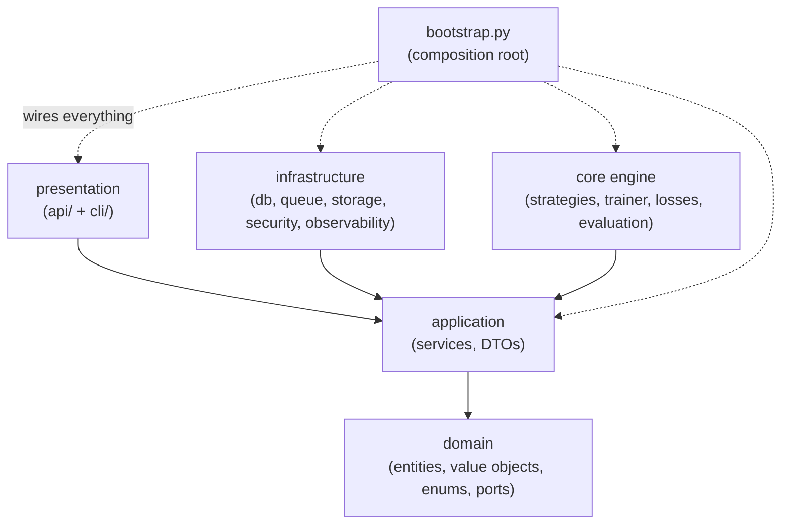

# Developer guide

This guide is for engineers working **on** Distillery rather than just using it.
It covers local setup, the Clean Architecture layering and its dependency rule,
how to add a new distillation strategy and a new LLM provider, how to run the
services locally, the testing approach, and the lint/type/format/commit
workflow.

For the runtime behaviour of the platform, read the
[User guide](./user-guide.md) and [Architecture overview](../architecture/overview.md) first.

---

## 1. Local setup

Distillery is the package `distillery`, uses a `src/` layout, and targets
**Python 3.10–3.12**.

```bash
make install        # create .venv and install the package with dev extras (editable)
make install-hooks  # install the pre-commit git hooks (optional but recommended)
```

`make install` builds a virtual environment in `.venv/` and runs
`pip install -e ".[dev]"`. After it completes, the `distillery` CLI entry point
is available (you can also invoke it as `python -m distillery`).

Copy `.env.example` to `.env` and adjust as needed; settings are read from the
environment with the `DISTILLERY_` prefix and `__` as the nesting separator
(e.g. `DISTILLERY_QUEUE__EAGER`).

---

## 2. Architecture and the dependency rule

Distillery follows **Clean Architecture**. Layers depend only *inward* — an
inner layer must never import an outer one.



- **domain/** — the innermost layer: entities, value objects, enums, and
  **ports** (`domain/ports.py`). It depends on nothing else in the project.
- **application/** — orchestrates use cases (services, DTOs); depends only on
  the domain.
- **core engine** and **infrastructure** — depend on application/domain and
  implement the ports (training engine; database, queue, storage, security,
  observability adapters).
- **presentation** — `api/` (FastAPI) and `cli/` (Typer).
- **composition root** — `src/distillery/bootstrap.py` is the only place that
  wires concrete implementations to the ports.

Practical rules:

- Inner layers never import outer layers. The dependency rule is the single
  most important constraint to preserve.
- Ports (interfaces) live in `domain/ports.py`; adapters live in
  `infrastructure/`.
- **Lazy imports** keep heavy/optional dependencies (`torch`, `celery`,
  `boto3`) out of import time — import them inside the function that needs them,
  not at module top level. This keeps the API/CLI fast to start and the domain
  importable without ML libraries installed.

See the [Architecture overview](../architecture/overview.md) for the full
picture.

---

## 3. Add a new distillation strategy

A *strategy* encapsulates the per-batch loss computation; the optimisation loop
in `DistillationTrainer` is strategy-agnostic. Adding one is the Open/Closed
Principle in action — you register a factory and existing call sites keep
working.

### Steps

1. **Subclass** `distillery.core.strategies.base.DistillationStrategy` and
   implement `compute_loss(self, batch, student, teacher, device) -> tuple[Tensor, dict]`.
   Optionally override `setup()` (to build device-resident auxiliary modules
   such as projection layers), `aux_parameters()` (to expose extra trainable
   parameters to the optimiser), and the class attribute
   `requires_teacher` (set it to `False` if the strategy trains without a
   teacher bundle).
2. **Register** a factory keyed by the `DistillationStrategy` enum via
   `distillery.core.strategies.registry.register_strategy`.
3. If it is a **brand-new** strategy (new public name), add the enum value in
   `domain/enums.py` and the corresponding validation in
   `domain/value_objects.py`.

### Complete example

A minimal "logits-MSE" strategy that regresses the student's logits onto the
teacher's:

```python
# src/distillery/core/strategies/logit_mse.py
from __future__ import annotations

import torch
import torch.nn.functional as F

from distillery.core.models import ModelBundle
from distillery.core.strategies.base import DistillationStrategy


class LogitMSEStrategy(DistillationStrategy):
    """Match the teacher's raw logits with a mean-squared-error loss."""

    requires_teacher = True  # we need a teacher bundle at train time

    def compute_loss(
        self,
        batch: dict[str, torch.Tensor],
        student: ModelBundle,
        teacher: ModelBundle | None,
        device: torch.device,
    ) -> tuple[torch.Tensor, dict[str, float]]:
        assert teacher is not None  # guaranteed because requires_teacher is True
        inputs = {k: v for k, v in batch.items() if k != "labels"}
        student_logits = student.model(**inputs).logits
        with torch.no_grad():
            teacher_logits = teacher.model(**inputs).logits
        loss = F.mse_loss(student_logits, teacher_logits)
        return loss, {"logit_mse": float(loss.detach())}
```

Register it (typically near the registry, or in `bootstrap.py`). For a brand-new
public strategy you would first add `LOGIT_MSE = "logit_mse"` to the
`DistillationStrategy` enum in `domain/enums.py` and extend the validation in
`domain/value_objects.py`; then:

```python
from distillery.core.strategies.registry import register_strategy
from distillery.core.strategies.logit_mse import LogitMSEStrategy
from distillery.domain.enums import DistillationStrategy

register_strategy(DistillationStrategy.LOGIT_MSE, lambda kd: LogitMSEStrategy())
```

The factory receives the job's `KDHyperParams` (`kd`), so strategies that need
`temperature`, `alpha`, `feature_loss_weight`, or `feature_layer_map` can read
them off that argument (see how `ResponseBasedStrategy` and
`FeatureBasedStrategy` are registered for reference). Once registered, the
engine and API can run jobs with the new `strategy` value — no call-site
changes needed.

The second element of the returned tuple is a dict of named loss components; it
is surfaced for logging, so name the keys clearly.

---

## 4. Add a new LLM provider

The `llm_teacher` strategy depends only on a tiny, provider-agnostic interface
so any vendor (or an in-memory fake for tests) can be swapped in without
touching the dataset-building logic.

Implement the `distillery.teachers.llm.base.LLMClient` protocol — a single
method:

```python
# src/distillery/teachers/llm/myprovider_client.py
from __future__ import annotations

from distillery.teachers.llm.base import LLMClient, LLMResponse


class MyProviderClient(LLMClient):
    def __init__(self, api_key: str) -> None:
        self._api_key = api_key

    def complete(
        self,
        *,
        system: str,
        prompt: str,
        model: str,
        max_tokens: int,
        temperature: float,
    ) -> LLMResponse:
        # ... call your provider's SDK here (import it lazily) ...
        text = "..."  # the model's completion
        return LLMResponse(text=text, input_tokens=0, output_tokens=0)
```

`LLMResponse` carries the completion `text` plus optional `input_tokens` /
`output_tokens` for accounting. Because `LLMClient` is a `runtime_checkable`
`Protocol`, your class does not need to inherit from it — it just needs the
matching `complete(...)` signature. Wire your client where the LLM teacher is
constructed (the composition root in `bootstrap.py`). Keep the provider SDK
import lazy so it stays out of import time.

---

## 5. Running the services locally

### Full stack with Docker Compose

```bash
make up      # build + start: postgres, redis, api (:8000), worker, prometheus (:9090), grafana (:3000)
make logs    # tail logs
make ps      # list services
make down    # stop and remove volumes
```

A bootstrap **admin** API key is seeded on startup; the local default is
`dev-local-admin-key` (send it in the `X-API-Key` header). The API serves
interactive docs at `/docs` and `/redoc`.

### Individual processes (against your own Postgres/Redis)

```bash
make migrate     # alembic upgrade head
make seed        # distillery db seed (system user + bootstrap keys)
make run-api     # uvicorn with --reload on :8000
make run-worker  # a Celery worker
```

The CLI exposes the same operations directly:

| Command | Purpose |
| ------- | ------- |
| `distillery distill <config.json\|yaml> --output <dir>` | Run a distillation locally (no DB/queue). |
| `distillery serve` | Run the API server. |
| `distillery worker` | Run a Celery worker. |
| `distillery db upgrade \| create-all \| seed` | Manage the database schema/seed. |
| `distillery user create <email> --password <pw> --role <role>` | Create a user. |
| `distillery apikey create <owner_email> --name <n> --role <r>` | Issue an API key (printed once). |
| `distillery version` | Print the version. |

### Eager mode

Set `DISTILLERY_QUEUE__EAGER=true` to run jobs **synchronously in-process**
instead of dispatching them to a Celery worker. This is how the tests execute
jobs end-to-end without standing up a broker; it is handy for local debugging
too.

---

## 6. Testing

### Offline-first

Tests run without network access or model downloads by building tiny models
from config and using inline data:

- `teacher.config_only = true` and `student.config_only = true` create
  randomly-initialised models from config only (no weight downloads).
- `dataset.format = "inline"` with `inline_rows = [{"text": ..., "label": 0/1}]`
  embeds the data directly.

Combined with `DISTILLERY_QUEUE__EAGER=true`, a full job can run inside a unit
test in milliseconds. Example configs to copy from live in `examples/configs/`.

### Markers

Tests are tagged so you can run a slice:

| Marker | Scope |
| ------ | ----- |
| `unit` | Fast, isolated units. |
| `integration` | Cross-component, with adapters wired up. |
| `e2e` | Full end-to-end flows. |
| `ml` | Tests that exercise the ML training path. |

```bash
make test            # full suite with coverage
make test-unit       # pytest -m unit
make test-integration
make test-e2e
```

### Coverage

Line coverage is enforced at **>= 95%**. `make test` runs with coverage and
reports term-missing; new code must be covered to keep the gate green.

---

## 7. Lint, types, formatting, and commits

Distillery uses **ruff** + **black** (line length **100**) and **mypy**
(strict-ish). The Clean Architecture dependency rule (inner layers never import
outer) is a review-time invariant — keep ports in `domain/ports.py` and lazy
imports in place.

| Task | Command | What it does |
| ---- | ------- | ------------ |
| Format | `make format` | `ruff check --fix` then `black`. |
| Lint | `make lint` | `ruff check` + `black --check`. |
| Types | `make typecheck` | `mypy` on the package. |
| All gates | `make check` | `lint` + `typecheck` + `test`. |
| Security | `make security` | dependency + static security scans (`pip-audit`, `bandit`). |

Recommended workflow:

```bash
make format     # tidy the diff
make check      # the same gates CI runs (lint + types + tests)
```

Install the git hooks with `make install-hooks` so formatting, lint, and basic
hygiene checks (trailing whitespace, YAML/TOML/JSON validity, large files,
private-key detection, merge-conflict markers, debug statements) run on every
commit before you push.

---

## Next steps

- [Architecture overview](../architecture/overview.md) — layering, components, and the engine.
- [API reference](../api/reference.md) — endpoints and payloads you build against.
- [Security](../security.md) — authentication, RBAC, and hardening.
- [Troubleshooting](./troubleshooting.md) — common errors and fixes.
- [User guide](./user-guide.md) — run distillations end-to-end.
