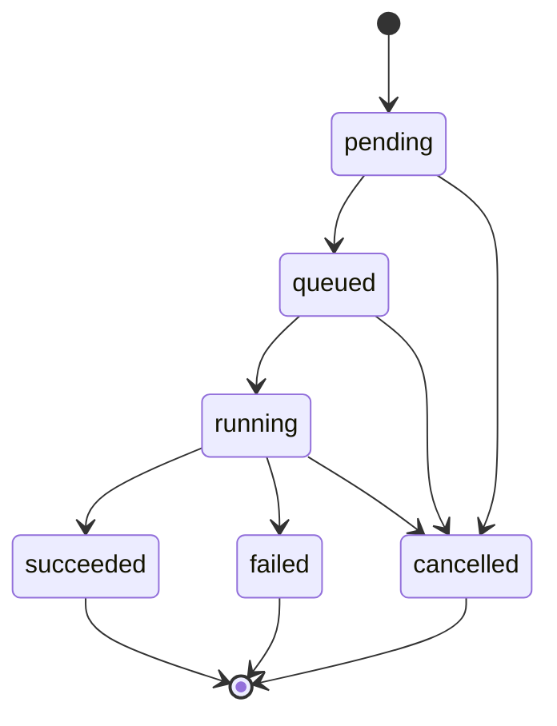

# User guide

This guide walks you through using **Distillery**, a production NLP
model-distillation platform, to shrink a large "teacher" model into a small,
fast "student" model. It is task-oriented: by the end you will have
authenticated, run all three distillation strategies (both over the REST API
and from the command line), polled a job to completion, downloaded and
interpreted the resulting artifacts and metrics, and learned how to cancel and
delete jobs.

If you have never seen the project before, skim the
[Architecture overview](../architecture/overview.md) first — but you do not need
it to follow along here.

---

## 1. Concepts you need

### Distillation strategies

Distillery supports three strategies. Each is selected with the `strategy`
field in a job's configuration.

| Strategy (`strategy`)  | `teacher_type` | What it does | Key requirement |
| ---------------------- | -------------- | ------------ | --------------- |
| `response_based`       | `huggingface`  | Classic Hinton soft-target knowledge distillation: the student matches the teacher's softened logits plus the hard labels. Loss = `alpha * T^2 * KL(teacher \|\| student) + (1 - alpha) * CE`. | Teacher and student must **share a tokenizer/vocabulary** and have **equal `num_labels`**. |
| `feature_based`        | `huggingface`  | Response-based KD **plus** an intermediate hidden-state MSE term that aligns the student's internal representations to the teacher's. | Same tokenizer/vocab and `num_labels`, **and** `kd.feature_loss_weight > 0`. |
| `llm_teacher`          | `llm`          | An LLM generates or labels a dataset, then the student is supervised-fine-tuned on it. No shared-vocabulary constraint (the LLM is not a HuggingFace classifier). | An `llm` config block, and `student.num_labels` must equal `len(llm.label_names)`. |

> The `response_based` and `feature_based` strategies require the teacher and
> student to share a tokenizer/vocabulary and have the same number of labels,
> because the loss compares logits position-by-position.

### Roles (RBAC)

Every request is made by a *principal* with one of three roles, ordered by
privilege: **viewer < operator < admin**.

| Action | Minimum role |
| ------ | ------------ |
| Read jobs, artifacts, metrics | viewer |
| Create / cancel / delete jobs | operator |
| Create users | admin |

See [Security](../security.md) for the full authorization model.

### Job lifecycle

A job moves through these states:



`succeeded`, `failed`, and `cancelled` are terminal.

---

## 2. Authenticate

The REST API base path is `/api/v1`. Every endpoint except the probes
(`/health`, `/ready`, `/metrics`) requires authentication, supplied **either**
as an API key header **or** a bearer JWT:

```
X-API-Key: <key>
```
or
```
Authorization: Bearer <jwt>
```

Examples below assume the API is reachable at `http://localhost:8000` (the
default when you run the local stack — see the
[Developer guide](./developer-guide.md#running-the-services-locally)).

### Option A — use an API key

When the stack starts, a bootstrap **admin** API key is seeded. The local
default is `dev-local-admin-key`. Use it directly:

```bash
export KEY=dev-local-admin-key
curl -s http://localhost:8000/api/v1/auth/me -H "X-API-Key: $KEY" | jq .
```

To mint a scoped key of your own (the plaintext secret is shown **once** and is
prefixed `dst_`):

```bash
curl -s -X POST http://localhost:8000/api/v1/auth/api-keys \
  -H "X-API-Key: $KEY" -H 'Content-Type: application/json' \
  -d '{"name": "my-laptop", "role": "operator"}' | jq .
# -> { "id": "...", "name": "my-laptop", "prefix": "dst_...", "api_key": "dst_....", ... }
```

`role` (default `operator`) and `expires_at` (ISO-8601, optional) can be set in
the body. Store `api_key` securely — it cannot be retrieved again. List your
keys (without secrets) with `GET /api/v1/auth/api-keys`.

### Option B — log in for a JWT

If you have a user account, exchange email + password for a short-lived token:

```bash
curl -s -X POST http://localhost:8000/api/v1/auth/login \
  -H 'Content-Type: application/json' \
  -d '{"email": "me@example.com", "password": "correct horse battery"}' | jq .
# -> { "access_token": "<jwt>", "token_type": "bearer", "expires_in": 3600 }
```

Then send `Authorization: Bearer <access_token>` on subsequent requests.

### Creating users (admin only)

```bash
curl -s -X POST http://localhost:8000/api/v1/auth/users \
  -H "X-API-Key: $KEY" -H 'Content-Type: application/json' \
  -d '{"email": "analyst@example.com", "password": "at-least-12-chars!", "role": "viewer"}'
```

Passwords must be **at least 12 characters**. `role` defaults to `viewer`.

---

## 3. Anatomy of a job configuration

A job is created from a `DistillationConfig`. Over the API it is wrapped in a
create request: `{"name": "...", "config": { ... }}`. The CLI's `distill`
command takes the **bare** config object as its file.

The config has this shape (only the fields relevant to your strategy are
required):

```jsonc
{
  "strategy": "response_based",          // response_based | feature_based | llm_teacher
  "teacher_type": "huggingface",         // huggingface | llm
  "device": "auto",                      // auto | cpu | cuda | mps
  "teacher": {                            // required for response/feature; omit for llm_teacher
    "name_or_path": "...",
    "num_labels": 2,
    "max_seq_length": 128,
    "revision": null,
    "trust_remote_code": false,
    "dtype": "float32",                  // float32 | float16 | bfloat16
    "config_only": false
  },
  "student": { /* same fields as teacher */ },
  "dataset": {
    "format": "hf_hub",                  // hf_hub | jsonl | csv | inline
    "reference": "glue/sst2",            // dataset id / path / url, per format
    "text_column": "text",
    "label_column": "label",
    "train_split": "train",
    "eval_split": "validation",
    "label_names": ["negative", "positive"],
    "max_train_samples": null,
    "max_eval_samples": null,
    "inline_rows": []                    // used only when format == "inline"
  },
  "training": {
    "epochs": 3, "train_batch_size": 16, "eval_batch_size": 32,
    "learning_rate": 5e-5, "weight_decay": 0.01, "warmup_ratio": 0.1,
    "max_grad_norm": 1.0, "gradient_accumulation_steps": 1, "seed": 42,
    "early_stopping_patience": null, "max_steps": null
  },
  "kd": {
    "temperature": 2.0, "alpha": 0.5,
    "feature_loss_weight": 0.0,          // must be > 0 for feature_based
    "feature_layer_map": {}              // student layer -> teacher layer
  },
  "llm": {                                // required for llm_teacher only
    "model": "claude-sonnet-4-6",
    "task_description": "...",
    "label_names": ["negative", "positive"],
    "num_samples": 200, "temperature": 0.7, "max_tokens": 1024,
    "seed_examples": [], "label_existing": false
  }
}
```

Ready-to-use example configs ship in `examples/configs/`
(`response_based.json`, `feature_based.json`, `llm_teacher.json`), and example
API request bodies (the wrapped `{name, config}` form) live in
`examples/requests/`.

### Running offline (no network)

For demos, tests, and CI you can run a complete distillation without touching
the network or downloading weights:

- set `teacher.config_only = true` and `student.config_only = true` (builds
  randomly-initialised models from config only), and
- set `dataset.format = "inline"` with rows in `inline_rows`, e.g.
  `[{"text": "great movie", "label": 1}, {"text": "awful", "label": 0}]`.

The offline examples below use this pattern so you can run them as-is.

---

## 4. Run each strategy end-to-end

Two ways to run a job:

- **REST API** (`POST /api/v1/jobs`) — the job is persisted and executed by a
  worker; you poll for status. This is the production path.
- **CLI** (`distillery distill`) — runs locally and synchronously with **no
  database or queue**. Ideal for experimentation and reproducible offline runs.

### 4a. `response_based` (soft-target KD)

Save this offline config as `response.json`:

```json
{
  "strategy": "response_based",
  "teacher_type": "huggingface",
  "device": "cpu",
  "teacher": { "name_or_path": "distilbert-base-uncased", "num_labels": 2, "config_only": true },
  "student": { "name_or_path": "distilbert-base-uncased", "num_labels": 2, "config_only": true },
  "dataset": {
    "format": "inline",
    "label_names": ["negative", "positive"],
    "inline_rows": [
      {"text": "I absolutely loved this film", "label": 1},
      {"text": "A complete waste of time", "label": 0},
      {"text": "Best movie of the year", "label": 1},
      {"text": "I want my money back", "label": 0}
    ]
  },
  "training": { "epochs": 1, "train_batch_size": 2, "eval_batch_size": 2 },
  "kd": { "temperature": 2.0, "alpha": 0.5 }
}
```

**Via CLI** (bare config, runs locally):

```bash
distillery distill response.json --output ./artifacts/response
```

The command prints per-step progress and a results summary (accuracy, teacher
agreement, compression ratio, student parameter count, duration) and writes all
artifacts under `--output`.

**Via API** (wrap the config under `config` and give the job a `name`):

```bash
curl -s -X POST http://localhost:8000/api/v1/jobs \
  -H "X-API-Key: $KEY" -H 'Content-Type: application/json' \
  -d "{\"name\": \"response-demo\", \"config\": $(cat response.json)}" | jq '.id, .status'
# -> "job_...", "pending"   (HTTP 202 Accepted)
```

### 4b. `feature_based` (response KD + hidden-state MSE)

Same as above but with `strategy: "feature_based"` and a positive
`feature_loss_weight`. Save as `feature.json`:

```json
{
  "strategy": "feature_based",
  "teacher_type": "huggingface",
  "device": "cpu",
  "teacher": { "name_or_path": "distilbert-base-uncased", "num_labels": 2, "config_only": true },
  "student": { "name_or_path": "distilbert-base-uncased", "num_labels": 2, "config_only": true },
  "dataset": {
    "format": "inline",
    "label_names": ["negative", "positive"],
    "inline_rows": [
      {"text": "I absolutely loved this film", "label": 1},
      {"text": "A complete waste of time", "label": 0},
      {"text": "Best movie of the year", "label": 1},
      {"text": "I want my money back", "label": 0}
    ]
  },
  "training": { "epochs": 1, "train_batch_size": 2, "eval_batch_size": 2 },
  "kd": { "temperature": 2.0, "alpha": 0.5, "feature_loss_weight": 0.5, "feature_layer_map": {"5": 11} }
}
```

`feature_layer_map` maps a **student** layer index to a **teacher** layer index
(here student layer 5 is aligned to teacher layer 11); leave it empty to use a
sensible default mapping. If you forget to set `feature_loss_weight > 0`, the
config is rejected with a validation error.

```bash
distillery distill feature.json --output ./artifacts/feature
# or POST it to /api/v1/jobs exactly as in 4a.
```

### 4c. `llm_teacher` (LLM generates/labels data, then fine-tune)

Here there is **no** HuggingFace teacher; an LLM provides supervision. Set
`teacher_type: "llm"`, omit `teacher`, and add an `llm` block. The student's
`num_labels` must equal `len(llm.label_names)`. Save as `llm.json`:

```json
{
  "strategy": "llm_teacher",
  "teacher_type": "llm",
  "device": "cpu",
  "student": { "name_or_path": "distilbert-base-uncased", "num_labels": 2, "config_only": true },
  "dataset": {
    "format": "inline",
    "label_names": ["negative", "positive"],
    "inline_rows": [
      {"text": "I absolutely loved this film", "label": 1},
      {"text": "A complete waste of time", "label": 0}
    ]
  },
  "training": { "epochs": 1, "train_batch_size": 2, "eval_batch_size": 2 },
  "llm": {
    "model": "claude-sonnet-4-6",
    "task_description": "Sentiment of short movie reviews",
    "label_names": ["negative", "positive"],
    "num_samples": 50,
    "label_existing": true
  }
}
```

- `label_existing: true` makes the LLM **label** the provided dataset; set it to
  `false` to have the LLM **generate** `num_samples` synthetic examples (use
  `seed_examples` to anchor the style with a few-shot prompt).
- Unlike the offline response/feature demos, `llm_teacher` calls a real LLM
  provider, so a provider must be configured (e.g. set
  `DISTILLERY_LLM__ANTHROPIC_API_KEY`). The student fine-tuning itself still
  runs locally.

```bash
distillery distill llm.json --output ./artifacts/llm
# or POST it to /api/v1/jobs exactly as in 4a.
```

---

## 5. Poll a job to completion

When you create a job over the API it returns `202` immediately and runs
asynchronously. Poll it by id:

```bash
JOB=job_...   # the id returned by POST /api/v1/jobs
watch -n 2 "curl -s http://localhost:8000/api/v1/jobs/$JOB \
  -H 'X-API-Key: $KEY' | jq '{status, progress_percent}'"
```

A `JobResponse` includes: `id`, `name`, `status`, `owner_id`,
`progress_percent`, `config`, `evaluation`, `resource_usage`, `artifacts[]`,
`task_id`, and timestamps. Watch `status` move `pending -> queued -> running ->
succeeded` and `progress_percent` climb to 100.

List your jobs (filter and paginate with query params):

```bash
# status=<state>  mine=<bool>  limit=<1..100>  offset=<n>
curl -s "http://localhost:8000/api/v1/jobs?status=running&mine=true&limit=20&offset=0" \
  -H "X-API-Key: $KEY" | jq '.items[] | {id, name, status}'
```

`mine` defaults to `true`; an admin can pass `mine=false` to see all owners'
jobs.

---

## 6. Download and interpret artifacts and metrics

### Artifacts

Once a job succeeds, list its artifacts:

```bash
curl -s http://localhost:8000/api/v1/jobs/$JOB/artifacts -H "X-API-Key: $KEY" | jq .
```

Each entry has a `type`, a `uri` (the storage location to fetch from), a
`size_bytes`, an optional `checksum`, and `metadata`. The artifact types are:

| Artifact type        | Contents |
| -------------------- | -------- |
| `student_model`      | The trained, compressed student model (load this for inference). |
| `evaluation_report`  | Full metrics report (the same numbers surfaced under `evaluation`). |
| `config_snapshot`    | The exact `DistillationConfig` used, for reproducibility. |
| `training_log`       | Step-by-step training log. |
| `synthetic_dataset`  | The LLM-generated/labelled dataset (produced by `llm_teacher`). |

When you use the CLI, these same artifacts are written to the `--output`
directory directly.

### Evaluation metrics

The `evaluation` block (and the `evaluation_report` artifact) report how good
and how small the student is:

| Field | Meaning |
| ----- | ------- |
| `student_metrics` | `{accuracy, precision_macro, recall_macro, f1_macro}` for the student. |
| `teacher_metrics` | The same metrics for the teacher, as a baseline. |
| `teacher_agreement` | **Fidelity** in `0..1`: fraction of examples where student and teacher predict the same label. High agreement means the student faithfully imitates the teacher. |
| `primary_metric` | The headline metric (accuracy) used to summarise the run. |
| `teacher_accuracy_retention` | How much of the teacher's accuracy the student keeps (student accuracy relative to teacher). |
| `compression_ratio` | How many times smaller the student is than the teacher (e.g. `2.5` = 2.5x fewer parameters). |
| `size_reduction_percent` | The size reduction as a percentage. |
| `student_latency_ms` / `teacher_latency_ms` | Mean single-example inference latency, in milliseconds, for student vs. teacher. |

A good distillation run shows high `teacher_agreement` and
`teacher_accuracy_retention`, a `compression_ratio` well above 1, and a
`student_latency_ms` much lower than `teacher_latency_ms`.

> Note: with `config_only: true` demo models the **weights are random**, so the
> accuracy numbers will be meaningless — these offline runs validate the
> pipeline, not model quality.

---

## 7. Cancel and delete jobs

Both actions require the **operator** role.

Cancel an in-flight job (returns the updated `JobResponse`):

```bash
curl -s -X POST http://localhost:8000/api/v1/jobs/$JOB/cancel -H "X-API-Key: $KEY" | jq '.status'
```

Delete a job and its record (returns `204 No Content`):

```bash
curl -s -o /dev/null -w '%{http_code}\n' \
  -X DELETE http://localhost:8000/api/v1/jobs/$JOB -H "X-API-Key: $KEY"
# -> 204
```

---

## 8. Service health and interactive docs

These endpoints are unauthenticated and useful for monitoring and exploration:

| Endpoint | Purpose |
| -------- | ------- |
| `GET /health` | Liveness probe. |
| `GET /ready` | Readiness probe (dependencies reachable). |
| `GET /metrics` | Prometheus metrics. |
| `GET /docs` | Interactive Swagger UI. |
| `GET /redoc` | ReDoc API reference. |

---

## Next steps

- [API reference](../api/reference.md) — every endpoint, payload, and error code.
- [Architecture overview](../architecture/overview.md) — how the platform is built.
- [Security](../security.md) — authentication, RBAC, and hardening details.
- [Troubleshooting](./troubleshooting.md) — common errors and fixes.
- [Developer guide](./developer-guide.md) — run the stack locally and extend Distillery.
