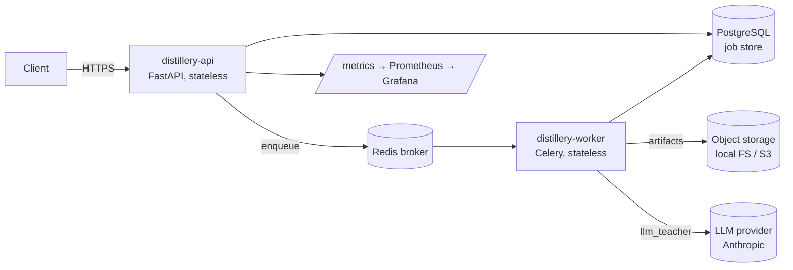
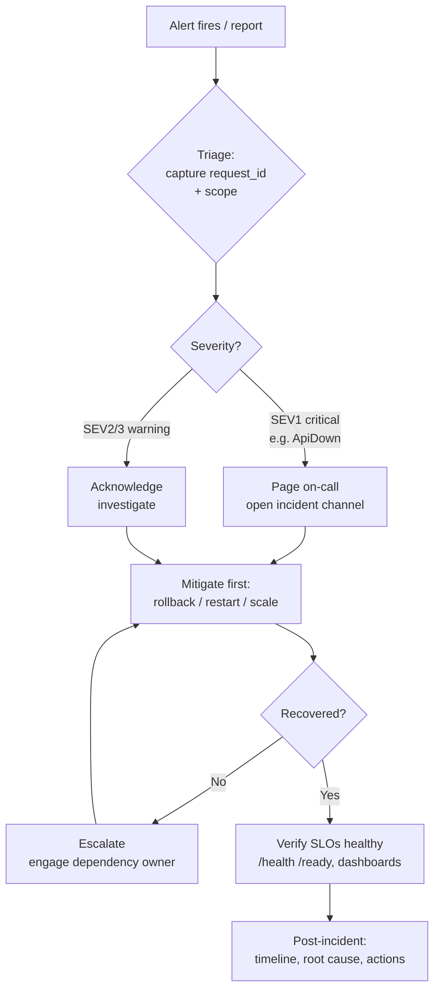
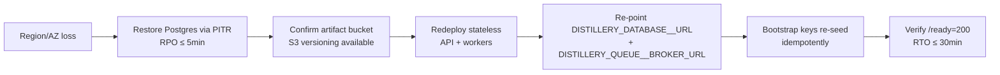

# Operations runbook

On-call reference for **Distillery** in production. It covers the service and its dependencies, the
SLOs you are defending, the dashboards and alerts to watch, a per-alert response playbook, the
incident-response flow, routine operational procedures, and capacity/cost notes.

**See also:** [Troubleshooting guide](../guides/troubleshooting.md) ·
[Architecture overview](../architecture/overview.md) · [Security](../security.md) ·
[Deployment guide](../guides/deployment-guide.md) · [Administrator guide](../guides/administrator-guide.md).

---

## 1. Service overview & dependencies

Distillery distills large NLP **teacher** models into small **student** models. It splits into a
stateless **API** (FastAPI) and horizontally-scalable **workers** (Celery) that run long training
jobs.



| Dependency | Role | Failure signature | Config key |
|---|---|---|---|
| **PostgreSQL** | Durable job + user store | `/ready` → `503`; `DistilleryApiDown` | `DISTILLERY_DATABASE__URL` |
| **Redis** | Celery broker + result backend | Jobs stuck in `queued` | `DISTILLERY_QUEUE__BROKER_URL`, `..__RESULT_BACKEND` |
| **Object storage** | Trained artifacts (local FS or S3) | Artifact write/read errors | `DISTILLERY_STORAGE__*` |
| **LLM provider** | `llm_teacher` strategy | `teacher_error` job failures | `DISTILLERY_LLM__ANTHROPIC_API_KEY` |
| **Prometheus/Grafana** | Metrics + alerting | Blind operations | scrapes `/metrics` |

**Key property — both API and worker are stateless.** All durable state lives in **PostgreSQL** and
**object storage**. You can freely restart, scale, and replace API/worker pods. See the
[Architecture overview](../architecture/overview.md) for the full topology.

**Health surfaces:**

- `GET /health` — liveness, dependency-free (process up).
- `GET /ready` — readiness, runs `SELECT 1`; `503` if PostgreSQL is unreachable.
- `GET /metrics` — Prometheus exposition.

---

## 2. SLOs

| SLO | Target | Source signal |
|---|---|---|
| **API availability** | ≥ 99.9% | `up{job="distillery-api"}`; `DistilleryApiDown` |
| **API latency (p95)** | < 1.5 s | `distillery_http_request_duration_seconds` (histogram) |
| **API error rate** | < 5% 5xx | `distillery_http_requests_total{status=~"5.."}` ratio |
| **Job success rate** | high; alert on spikes | `distillery_jobs_finished_total{status}` |
| **DR — RPO** | ≤ 5 min | Managed Postgres PITR |
| **DR — RTO** | ≤ 30 min | Restore + redeploy stateless services |

The alert thresholds (below) are intentionally aligned to these SLOs.

---

## 3. Dashboards & metrics to watch

**Grafana dashboard:** **"Distillery Overview"**. Prometheus scrapes the API at `/metrics`.

| Metric | Type | Watch for |
|---|---|---|
| `distillery_http_requests_total{method,path,status}` | counter | 5xx ratio (error budget) |
| `distillery_http_request_duration_seconds` | histogram | p95/p99 latency |
| `distillery_jobs_created_total{strategy}` | counter | demand by strategy |
| `distillery_jobs_finished_total{status}` | counter | success vs. `failed` |
| `distillery_jobs_in_progress` | gauge | backlog / worker saturation |
| `distillery_job_duration_seconds` | histogram | training time drift |
| `distillery_llm_teacher_tokens_total` | counter | LLM spend driver |

Alert rules live in `deploy/monitoring/alerts.yml`.

---

## 4. Alert-response playbook

| Alert | Severity | Condition |
|---|---|---|
| `DistilleryApiDown` | critical | `up == 0` for 2m |
| `DistilleryHighErrorRate` | warning | > 5% 5xx over 5m |
| `DistilleryHighLatencyP95` | warning | p95 > 1.5s for 10m |
| `DistilleryJobFailureSpike` | warning | > 5 failed jobs in 15m |

### 4.1 DistilleryApiDown (critical)

**Symptom:** No successful scrape of the API for 2 minutes (`up{job="distillery-api"} == 0`).

**Diagnosis:**

```bash
kubectl get pods -l app=distillery-api
kubectl describe deploy/distillery-api
kubectl logs deploy/distillery-api --tail=200
curl -s -o /dev/null -w '%{http_code}\n' https://<host>/health   # liveness
curl -s -o /dev/null -w '%{http_code}\n' https://<host>/ready    # 503 ⇒ DB down
```

1. Are pods running and passing probes? `/ready` `503` points at **PostgreSQL** (check
   `DISTILLERY_DATABASE__URL`).
2. Recent rollout? Suspect the new revision.
3. Crash on boot? Check **production fail-fast** (weak JWT secret <32 chars, or
   `DISTILLERY_DEBUG=true`) — the startup error names the setting.

**Remediation:**

```bash
kubectl rollout undo deploy/distillery-api          # if a bad deploy
kubectl rollout restart deploy/distillery-api       # if pods are wedged
```

Restore PostgreSQL connectivity if `/ready` is `503` (see [§6.7 DB restore](#67-db-restore--pitr)).

### 4.2 DistilleryHighErrorRate (warning)

**Symptom:** More than 5% of HTTP responses are 5xx over 5 minutes.

**Diagnosis:**

```bash
# Which paths/status are erroring? (PromQL)
topk(5, sum by (path,status) (rate(distillery_http_requests_total{status=~"5.."}[5m])))
# Pull a sample request id from logs, then trace it end to end:
kubectl logs deploy/distillery-api | grep '"status": 5' | head
kubectl logs deploy/distillery-api | grep <request_id>
```

1. Distinguish `500 internal_error`/`training_error` from `502 teacher_error`.
2. A burst of `502 teacher_error` points at the **LLM provider** (key, rate limits, malformed JSON).
3. Correlate with a recent deploy or a dependency (DB/Redis) incident.

**Remediation:** roll back a bad deploy (`kubectl rollout undo`); restore the failing dependency; for
LLM issues see [Troubleshooting → teacher_error](../guides/troubleshooting.md#failed-teacher_error).

### 4.3 DistilleryHighLatencyP95 (warning)

**Symptom:** p95 request latency above 1.5s for 10 minutes.

**Diagnosis:**

```bash
# p95 by path (PromQL)
histogram_quantile(0.95,
  sum by (le,path) (rate(distillery_http_request_duration_seconds_bucket[5m])))
```

1. Check DB latency / connection-pool exhaustion (`DISTILLERY_DATABASE__POOL_SIZE`,
   `MAX_OVERFLOW`, `POOL_TIMEOUT_SECONDS`).
2. Check CPU/memory saturation on API pods and HPA behavior.
3. Rule out a noisy dependency or a slow synchronous teacher call path.

**Remediation:** scale the API (HPA or replicas), tune the DB pool, or roll back a regression.

### 4.4 DistilleryJobFailureSpike (warning)

**Symptom:** More than 5 jobs failed in the last 15 minutes
(`increase(distillery_jobs_finished_total{status="failed"}[15m]) > 5`).

**Diagnosis:**

```bash
kubectl logs deploy/distillery-worker --tail=300 | grep -E 'teacher_error|training_error'
```

1. **`teacher_error`** — LLM teacher: missing/invalid `DISTILLERY_LLM__ANTHROPIC_API_KEY`, provider
   rate limits, or malformed model JSON.
2. **`training_error`** — empty dataloader or **OOM**.

**Remediation:**

- LLM: set/rotate `DISTILLERY_LLM__ANTHROPIC_API_KEY`; lower `DISTILLERY_LLM__MAX_CONCURRENCY` if
  rate-limited.
- OOM: reduce `training.train_batch_size`, set `training.max_train_samples`/`max_steps`, use a
  smaller student, or `device=cpu`.

Full detail: [Troubleshooting → job failed](../guides/troubleshooting.md#failed-training_error--oom).

---

## 5. Incident-response flow



**Triage with `request_id`.** Every response carries `X-Request-ID`, mirrored in `error.request_id`
and in every JSON log line. Start from the ID and pivot to logs:

```bash
kubectl logs deploy/distillery-api    | grep <request_id>
kubectl logs deploy/distillery-worker | grep <job_id>
```

**Severity guide:**

| Severity | Examples | Response |
|---|---|---|
| **SEV1 (critical)** | `DistilleryApiDown`, total DB outage | Page on-call, open incident channel, mitigate immediately. |
| **SEV2 (warning)** | Sustained `HighErrorRate` / `HighLatencyP95` | Acknowledge, investigate, mitigate within the hour. |
| **SEV3 (warning)** | `JobFailureSpike`, degraded throughput | Investigate; fix root cause; no customer-facing outage. |

**Communications:** acknowledge the page, post status + suspected scope in the incident channel,
update on mitigation and recovery, and write a brief post-incident note (timeline, root cause,
follow-up actions). Mitigate before perfecting the diagnosis.

---

## 6. Routine procedures

### 6.1 Deploy

```bash
# Kubernetes (Kustomize overlays). Migrations run as a Job that MUST succeed before rollout.
kubectl apply -k deploy/kubernetes/overlays/production
kubectl rollout status deploy/distillery-api
kubectl rollout status deploy/distillery-worker
# Verify
curl -s -o /dev/null -w '%{http_code}\n' https://<host>/ready
```

```bash
# Local / Compose
make up        # build + start the full stack
make ps        # service status
make logs      # tail logs
make down      # stop (removes volumes)
```

Confirm the migration Job succeeded before declaring success — see [§6.6](#66-migrations).

### 6.2 Rollback

```bash
kubectl rollout undo deploy/distillery-api
kubectl rollout undo deploy/distillery-worker
kubectl rollout status deploy/distillery-api
```

Because services are stateless, rollback is safe as long as the DB schema is compatible (avoid
destructive migrations in the same release as code that still needs the old schema).

### 6.3 Scale workers

```bash
kubectl scale deploy/distillery-worker --replicas=N
```

Scale up when `distillery_jobs_in_progress` and the queue backlog grow. Per-worker parallelism is set
by `DISTILLERY_QUEUE__WORKER_CONCURRENCY`. The API can scale independently (HPA).

### 6.4 Drain a worker

Workers use **`acks_late` + `reject_on_worker_lost`**, so in-flight tasks are redelivered if a worker
is lost. To drain gracefully:

```bash
# Stop consuming new tasks but finish in-flight work, then let the pod terminate:
celery -A distillery.infrastructure.queue.celery_app:celery_app inspect active   # see what's running
# Reduce replica count to drain capacity:
kubectl scale deploy/distillery-worker --replicas=<N-1>
```

> **Caveat:** if a worker is killed mid-run, the task is redelivered but the pipeline only proceeds
> when the job is still `QUEUED`. A job left in `RUNNING` after an ungraceful kill needs **manual
> re-queue or cancel** — see
> [Troubleshooting → stuck in RUNNING](../guides/troubleshooting.md#job-stuck-in-running-after-a-worker-crash).

### 6.5 Rotate secrets / keys

- **JWT secret** (`DISTILLERY_SECURITY__JWT_SECRET`): must be ≥ 32 chars in production. Rotating
  invalidates existing JWTs (users re-login). Generate with
  `python -c "import secrets; print(secrets.token_urlsafe(64))"`.
- **API keys:** managed via the API/CLI; only a prefix + SHA-256 digest are stored. Issue new keys,
  hand them out, then revoke old ones.
- **Bootstrap keys** (`DISTILLERY_SECURITY__BOOTSTRAP_API_KEYS`): hashed at startup and **re-seeded
  idempotently** — safe to reapply.
- **LLM/cloud creds:** update `DISTILLERY_LLM__ANTHROPIC_API_KEY` / AWS env vars via the secret
  manager and restart the affected deployment.

```bash
# Apply rotated K8s secret, then restart to pick it up:
kubectl rollout restart deploy/distillery-api deploy/distillery-worker
```

See [Security](../security.md) and the [Administrator guide](../guides/administrator-guide.md) for the
full key/secret model.

### 6.6 Migrations

```bash
distillery db upgrade        # or: alembic upgrade head
```

Failures usually mean the **DB is unreachable** or there is a **pending revision** — verify
`DISTILLERY_DATABASE__URL`. In **Kubernetes the migration Job must succeed before the rollout
proceeds**; inspect it with `kubectl logs job/<migration-job>`.

### 6.7 Backups & DB restore / PITR

**State is only in PostgreSQL + object storage**, so backups target exactly those two:

- **PostgreSQL:** managed **Point-In-Time Recovery (PITR)** — target **RPO ≤ 5 min**, **RTO ≤ 30
  min**.
- **Artifacts:** **S3 versioning** protects against overwrite/delete.

**Verify backups (routine):** confirm PITR/snapshot recency in the managed-Postgres console and that
S3 versioning is enabled on the artifact bucket.

**Restore / PITR procedure:**

1. Restore PostgreSQL to the target timestamp via the managed provider (PITR).
2. Point `DISTILLERY_DATABASE__URL` at the restored instance.
3. Restart/redeploy the stateless API + workers; bootstrap keys re-seed idempotently.
4. Verify `GET /ready` returns `200` and the dashboards recover.

### 6.8 Failover

Because API and worker are stateless, failover is **restore data, then redeploy**:



---

## 7. Capacity & cost notes

| Lever | Driver | Notes |
|---|---|---|
| **Worker replicas** | `distillery_jobs_in_progress`, queue backlog | Scale `deploy/distillery-worker`; tune `DISTILLERY_QUEUE__WORKER_CONCURRENCY`. |
| **API replicas** | p95 latency, request rate | Scale independently (HPA); stateless. |
| **DB connections** | API/worker concurrency | Size `DISTILLERY_DATABASE__POOL_SIZE` + `MAX_OVERFLOW` to instance limits. |
| **LLM spend** | `distillery_llm_teacher_tokens_total` | Cap with `DISTILLERY_LLM__MAX_CONCURRENCY`; track tokens as the cost signal. |
| **Compute (training)** | model/batch size, `device` | CPU image by default; **GPU** needs a CUDA-based image and `device=cuda`. |
| **Storage** | artifact volume + S3 versioning | Versioning increases storage; set lifecycle policies as needed. |
| **Image footprint** | PyTorch (CPU wheels) | Image is large by design; plan registry/pull bandwidth. |

For per-job tuning (batch size, sample/step caps, smaller students), see
[Troubleshooting → OOM](../guides/troubleshooting.md#failed-training_error--oom). For deployment
topologies and image builds, see the [Deployment guide](../guides/deployment-guide.md).
